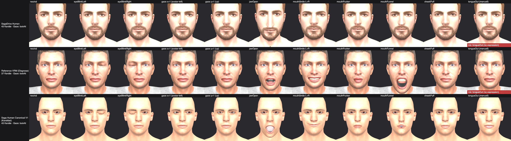
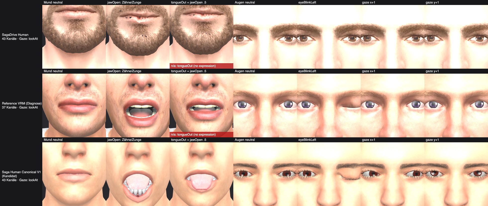
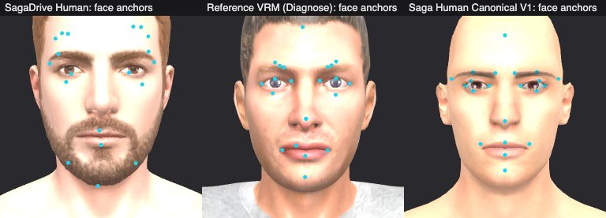

# Design — Saga Human Canonical V1 (MakeHuman CC0 als kanonische Human-Datenbasis)

**Slug:** `saga-human-canonical-v1`
**Datum:** 2026-09-25
**Branch:** `agent/liveact-reference-vrm-golden-avatar` (lokal autoritativ, nicht gepusht)
**Status:** PoC gebaut und gegen dieselbe LiveAct-Runtime gemessen (Abschnitt 11). Offen: manueller Webcam-A/B-Test durch den User.

Research-Quellen (lokal geklont, nur gelesen):

| Repo | Commit | Datum |
|---|---|---|
| makehumancommunity/makehuman | `a8bc2d54ff0ac92e78ff71431b1023eda42bf482` | 2024-06-26 |
| makehumancommunity/extra-targets | `7eaba3453134385bb5ea9811ef0b33b85b4b556d` | 2026-02-07 |
| makehumancommunity/makehuman2 | `65329ad0a27d7b92052eec24afb1dad2c823007c` | 2026-08-29 |
| makehumancommunity/mpfb2 (optional) | `7fcc8df56f26776923e0a825f4551c3c3779befe` | 2026-09-23 |
| MakeHuman System Asset Pack (CC0) | `mirror1.makehuman.net/asset_packs/makehuman_system_assets/makehuman_system_assets_cc0.zip` | nicht versioniert → pro Datei sha256 gepinnt |

`makehumancommunity/makehuman-assets` existiert auf GitHub nicht mehr (`gh repo view` / `git ls-remote`: not found). Die aktuelle Quelle für Zähne/Zunge/Wimpern/Brauen/Skins ist das CC0-System-Pack, das MakeHuman II selbst in `data/makehuman2_version.json` (`url_systemassets`) referenziert. Einzelne Dateien wurden per HTTP-Range aus dem 267-MB-Zip gezogen.

---

## 1. Local branch audit

- HEAD `8bfeb9d`, 15 Commits über `origin/main` (`ed2c12a`), 58 Dateien, +3328/−157.
- Der lokale `main` (`447e44f`) ist **veraltet** (hinter `origin/main`). Deshalb zeigt `git diff main...HEAD --stat` 238 Dateien, die echte Branch-Delta gegen `origin/main` ist 58 Dateien.
- `origin/agent/liveact-reference-vrm-golden-avatar` steht auf `3d1e7a4`. Nur lokal: `fbd3199`, `51adc50`, `019694f`, `8bfeb9d`.

Stack (unten → oben):

| Commit | Inhalt |
|---|---|
| `5f799be` `5e5d13b` `e232eb2` | Preview-Settings eingeklappt, „Setup"-Expand, Gear im Modal |
| `1f760ed` `bb9b06b` | Face-Mapping-Speichern-Leiste (eine Leiste am Viewport) |
| `43b0f53` `c82db99` | `face_anchors` am Character persistiert; Punkte bleiben nach Speichern sichtbar |
| `da20779` | Face-Overlay projiziert mit der Kamera des eigenen Viewports |
| `e2a86ca` | Tracking-Drive bindet an die Runtime des offenen 3D-Setup-Modals (= Head von PR #440) |
| `5de5ac5` `3d1e7a4` | Golden Reference VRM (ARKit52) als Mesh-Vorlage (Diagnose), Select über dem Grid |
| `fbd3199` | Auto-Face-Anchors für die Reference per ARKit-Morph-Seed (unreviewed) |
| `51adc50` | 1:1-Fidelity: Idle-Pause, Single-Baseline-Kalibrierung, 2-Schritt-Kalibrierung, Reference-Zähne |
| `019694f` | PR-#440-Review-Findings (Abschnitt 2) |
| `8bfeb9d` | Reference-Provenance: Original (immutable, LFS-sha256) vs. Derivat `saga-teeth-binds-v1` |

Im Code verifizierter Runtime-Stand. Alle Punkte sind in `scripts/liveact-fidelity-check.mjs` abgesichert, der Check hängt im Test-Gate.

- **Idle-Suppression:** `AvatarSurfaceViewer` ruft `setLiveActDriveActive(output !== null)` → `CharacterStudioRuntime.setLiveActDriveActive` → `animationRuntime.setSuspended`.
- **Kalibrierung:** `stepLiveActCalibratedFrame(this.pipelineStep, …)` mit EMA vor dem Neutral-Abzug. Schritt 1/2 = Neutral, Schritt 2/2 = 5 s Maximalbewegung (`LIVEACT_RANGE_CALIBRATION_DURATION_MS`). Die Gains sind Session-Gains und werden nicht persistiert.
- **Single Gaze Owner:** `resolveLiveActGazeDrivePath` wählt in der Reihenfolge bones → lookAt → morphs. Wenn Pose-Gaze aktiv ist, werden eyeLook-Morphs auf 0 gesetzt (`vrm-liveact-avatar-output.ts`).
- **Diagnose-Kette:** RAW→MAPPED→SMOOTHED→CALIBRATED→RETARGETED→APPLIED.
- **Expand-Runtime-Binding:** `e2a86ca`.

Working Tree:
- `.qa/evidence/debug-liveact-reference-fidelity-user.png` ist untracked. Es enthält das Webcam-Gesicht des Users und wird **nie committen**.
- `.qa/runs/*` sind Check-Bundles.
- `.qa/fixtures/liveact-face-mapping-manual/sample-binding.json` enthält nur Float-Rauschen aus einem Check-Lauf und bleibt ungestaged.

## 2. PR #440 reconciliation

[PR #440](https://github.com/iamthamanic/sagadrive/pull/440), Head `e2a86ca` (`agent/face-anchors-character-persist`). Geprüft wurde jeweils gegen den lokalen HEAD vor `019694f`.

| Finding | Status vor Fix | Beleg | Lokal jetzt |
|---|---|---|---|
| **P1** stale `avatar.face_anchors` bei unverändertem Model-URL/Manifest | STILL PRESENT | `loadModel` band Anchors nur einmal aus dem `avatar`-Argument des Loads (`void this.loadFaceAnchorsManifestForModel(safeUrl, avatar.face_anchors ?? null)`). `AvatarCanvas` ruft `loadModel` nur bei `[manifest, modelUrl]`-Änderung; eine Hydration mit neuen `face_anchors` lief nur in `applyAppearance`, das die Anchors nicht neu band. | **FIXED LOCALLY** (`019694f`): `syncCharacterFaceAnchors()` bindet bei jeder `applyAppearance` neu, wenn sich die `face_anchors`-Referenz ändert. Während eines Loads ist `faceAnchorsModelUrl = null`, damit keine Anchors des neuen Modells auf das alte Mesh fallen. Reset in `removeCurrentModel`. |
| **P2** leere Mapping-Drafts als Override speicherbar | STILL PRESENT | `applyFaceMapping` in `LiveActViewportControls.tsx` rief `faceMappingDraftToManifest(current)` ohne Validierung auf. Ein leeres Manifest gewinnt in `loadFaceAnchorsManifestForModel` gegen den Sidecar (Override vor Kandidaten). | **FIXED LOCALLY**: Guard `validateFaceMappingDraft(current)` (`ok` = `setCount > 0 && invalidCount === 0`) mit Meldung. Speichern-Button `disabled={!draftValidation?.ok}` plus Tooltip. |
| **P2** Anchors auf allen topology-changing paths löschen | STILL PRESENT | `applyBodyConversion` setzte `setAvatarSource('sagadrive')` ohne Anchor-Reset. `applyAppearancePreset` tauscht das Mesh, wenn weder `model_url` noch eine kanonische `body_family` es pinnt (`resolveAvatarModelUrl`-Reihenfolge), auch ohne Anchor-Reset. | **FIXED LOCALLY**: `setFaceAnchorsManifest(null)` in `applyBodyConversion` sowie in `applyAppearancePreset`, wenn der Race-Preset das Mesh tatsächlich wechselt. |
| **P2** Expanded Preview Runtime als aktiver LiveAct-Output bei offenem Modal | FIXED LOCALLY (schon im PR-Head) | `e2a86ca`: `AvatarSurfaceViewer` bindet den Drive bei `driveExpand` an die Modal-Runtime. `da20779`: Overlay nutzt die eigene Viewport-Kamera. Check: `liveact-expand-drive-bind-check`. | FIXED (unverändert) |

Regression-Asserts wurden in `scripts/liveact-face-anchors-character-persist-check.mjs` ergänzt. Gegenprobe ist grün: face-anchors-v1, face-mapping-manual/authoring/visual-guides, viewport-ui, expand-drive-bind, character-face-overlay.

Die Grenze bleibt erhalten: Face Anchors sind Overlay und semantische Geometrie-Zuordnung, kein Webcam→Morph-Drive.

**Offen (nur auf Anweisung):** `019694f` liegt auf diesem Branch, nicht auf dem PR-Branch. Für PR #440 müsste er auf `agent/face-anchors-character-persist` cherry-picked werden. Dabei ist evtl. ein kleiner Konflikt im Hook-Kontext möglich, weil dort der Reference-Code fehlt.

Die Reference-Provenance ist ebenfalls erledigt (`8bfeb9d`):
- **Original:** bleibt unverändert in `.cache/liveact-reference-vrm/White_M_1_Default.vrm`, verifiziert gegen die Upstream-LFS-oid `1ab7130c…cff9` (68 580 812 B).
- **Derivat:** Ausgeliefert wird das reproduzierbare Derivat `saga-teeth-binds-v1` (`323269ae…645b`, deterministisch nachgebaut und doppelt verifiziert).
- **Dokumentation:** Katalog, ATTRIBUTION und UI-Hint („abgeleitet vom Original …") benennen das Derivat. Der Golden-Avatar-Check schlägt fehl, wenn das Binary driftet.

## 3. MakeHuman asset inventory

Lizenz aller unten gelisteten Dateien: **CC0 1.0**. Belege: `makehuman/LICENSE.md` Abschnitt C („base mesh and proxies, targets and modifiers, textures, clothes, poses and expressions … CC0 1.0"), `extra-targets/LICENSE` (CC0 1.0) und CC0-Header in jeder Datei. Das maschinenlesbare, gepinnte Manifest ist `assets/species-3d/human-canonical-v1/sources.json` (72 Dateien, 11,9 MB, sha256 pro Datei).

| Rolle | Datei | Quelle | sha256 (Präfix) | Größe |
|---|---|---|---|---|
| Base Mesh hm08 | `makehuman/data/3dobjs/base.obj` | makehuman@a8bc2d5 | `8e761e6624b8` | 1,75 MB |
| Identity (ein Mensch) | `makehuman/data/targets/macrodetails/caucasian-male-young.target` | makehuman@a8bc2d5 | `70e228ba7164` | 396 KB |
| Rig | `makehuman/data/rigs/default.mhskel` | makehuman@a8bc2d5 | `99f179bce0aa` | 118 KB |
| Weights | `makehuman/data/rigs/default_weights.mhw` | makehuman@a8bc2d5 | `0f3641d651ae` | 898 KB |
| Eyes (Proxy) | `makehuman/data/eyes/high-poly/high-poly.{mhclo,obj}` | makehuman@a8bc2d5 | `b183cfe37120` / `da2493215b70` | 72 / 101 KB |
| Eyes (Textur) | `makehuman/data/eyes/materials/brown_eye.png` | makehuman@a8bc2d5 | `4659691c7295` | 611 KB |
| Faceunits | `assets/faceunits01/targets/faceunits/*.target` (52) | extra-targets@7eaba34 | kombiniert `9245a153cc33` | 1,0 MB |
| Teeth | `teeth/teeth_base/teeth_base.{mhclo,obj}` + `teeth.png` | System-Pack | `9edc3deff3bb` / `f55198069e55` / `d0afb57869c6` | 263 KB / 313 KB / 1,8 MB |
| Tongue | `tongue/tongue01/tongue01.{mhclo,obj}` + `tongue01_diffuse.png` | System-Pack | `61d825899cd7` / `12f4a6a9f85a` / `3150be398e48` | 2 KB / 17 KB / 625 KB |
| Eyelashes | `eyelashes/eyelashes01/eyelashes01.{mhclo,obj,png}` | System-Pack | `5a86b29c1564` / `f78f5b93fea1` / `4b69c0fff264` | 2 KB / 19 KB / 92 KB |
| Eyebrows | `eyebrows/eyebrow001/eyebrow001.{mhclo,obj,png}` | System-Pack | `54c8892c2ba5` / `88b131463951` / `9940f7d0b1b2` | 9 KB / 8 KB / 90 KB |
| Skin | `skins/young_caucasian_male/young_lightskinned_male_diffuse.png` (2048²) | System-Pack | `862a26e335e9` | 3,7 MB |

### hm08-Fakten (gemessen)

- **Umfang:** 19 158 Vertices, 21 334 UVs, 18 486 Faces (100 % Quads).
- **Einheit und Achsen:** **Dezimeter**, Y-up, Front +Z, Ursprung in Körpermitte. Y-Bereich −8,45…+8,50 dm (1,69 m).
- **Vertex-Ranges:** Alle Gruppen sind zusammenhängend und stabil:
  - `body` 0–13 379 (13 378 Quads)
  - `helper-tongue` 13 380–13 605
  - Joint-Cubes 13 606–14 597 (125 × 8) und 19 150–19 157
  - `helper-l-eye` 14 598–14 669 / `helper-r-eye` 14 670–14 741 (je 72 Vertices, Kugel mit r ≈ 16 mm auf der Identität)
  - Eyelashes 14 742–14 991
  - `helper-lower-teeth` 14 992–15 059 / `helper-upper-teeth` 15 060–15 127 (je 68)
  - genital 15 128–15 327, tights 15 328–18 001, skirt 18 002–18 721, hair 18 722–19 149
- **MH1 vs. MH2:** hm08 in MakeHuman II unterscheidet sich nur in 992 Joint-Cube-Vertices, die Faces sind identisch. Wir nutzen konsistent MH1-Mesh + MH1-Rig.

### `.target`-Format

- Pro Zeile `idx dx dy dz` in dm, sparse und rein additiv (Linearkombination). Kommentarzeilen `#` enthalten die CC0-Header.
- Das Identity-Target bewegt **19 150 von 19 158 Vertices** inkl. aller Helper und Joint-Cubes. Unbewegt bleibt nur `joint-ground` (19 150–19 157), das kein Bone nutzt. Proxies und Bones folgen der Identität also automatisch.
- `universal-male-young-averagemuscle-averageweight.target` ist leer: Durchschnitt = Identity.
- `caucasian-male-young` bewegt maximal 132,8 mm, vor allem Kopfhöhe und Proportionen. Körperhöhe danach 1,748 m (Base-Mesh 1,695 m).
- Expression-Targets (faceunits) werden anschließend linear addiert. Das ist deterministisch außerhalb von MakeHuman, weil kein Modifier-Code nötig ist.
- Einschränkung: Die faceunits sind auf dem Base-Mesh autoriert. Auf einer stark abweichenden Identität skaliert die Amplitude nicht mit. Das ist dasselbe Verhalten wie in MakeHuman.

### faceunits01 (52 Targets)

Die Namen sind exakt ARKit, also 51 LiveAct-Kanäle plus `tongueOut`. Regionen gemessen:

| Target | Betroffene Vertices und Maximalwerte |
|---|---|
| `jawOpen` | 2543 gesamt: body 2249 (max 38,7 mm), tongue 226 (28,1 mm), lower-teeth 68 (31,4 mm) |
| `jawLeft` / `jawRight` / `jawForward` | body + tongue 226 + lower-teeth 68 |
| `tongueOut` | nur tongue 226 (27,5 mm) |
| `eyeBlinkLeft` | body 718 (12,6 mm) + eyelashes 65 (15,5 mm), **kein** Eyeball |
| `eyeLook*` | body 336–708 + eyelashes 125 + der jeweilige Eye-Helper 72 (2,9–5,8 mm) |
| `mouthFunnel` | berührt Zähne nur mit 0,1 mm |

Upstream-README: **„Autogenerated ARKit face units"**. Die Qualität ist damit **nicht** belegt und muss visuell geprüft werden (Abschnitt 11).

### MHCLO (Proxy-Fitting)

- `x/y/z_scale a b den` → Skalierung pro Achse = |v_a − v_b| / den auf dem aktuellen Mesh.
- Pro Vertex entweder **1 Index**, dann exakte Kopie, oder **3 Indizes + 3 Gewichte + 3 Offsets**, dann p = Σ wᵢ·vᵢ + offset ⊙ scale.

| Proxy | Vertices | Bezug |
|---|---|---|
| Tongue01 | 226 | 1:1 = helper-tongue |
| Eyelashes01 | 250 | 1:1 = Eyelash-Helper |
| Low-Poly-Eyes | 96 | 1:1 |
| Teeth_Base | 3868 | baryzentrisch, **sauber getrennt**: 1884 nur auf lower-teeth, 1984 nur auf upper-teeth, 0 gemischt |
| High-Poly-Eyes | 1064 | baryzentrisch, je Auge 532 (Augapfel 276 + Hornhautschale 256), 0 gemischt |
| Eyebrow001 | 124 | baryzentrisch auf body |

- **Morph-Propagation:** Δp = Σ wᵢ·Δvᵢ (Skalierung bleibt auf Identity fixiert). Für 1:1-Proxies ist das exakt, für Zähne linear, weil der Offset nicht mitrotiert: Fehler ≲ 1 mm bei ~15° Kieferrotation.
- **Weight-Transfer:** w(p) = Σ wᵢ·w(vᵢ), da die Helper in `default_weights.mhw` gewichtet sind.
- **Material:** Die Proxy-`.mhmat`-Dateien referenzieren Diffuse-Texturen. Augen, Wimpern und Brauen haben Alpha.

### Rig (`default.mhskel`)

- **Umfang:** 163 Bones. Joints sind Vertex-Gruppen: Mittelwert eines Joint-Cubes oder ein Einzelvertex, z. B. `jaw____tail` = v991.
- **Pose:** Die Arme stehen in **A-Pose** und leicht nach vorne, nicht in T-Pose.
- **Eye-Bones:** `eye.L/R` (Kette head → special06 → special05 → eye). Der Kopfpunkt des Bones liegt **0,56 mm neben dem Augapfel-Zentrum** (Helper-Zentroid, Identität).
- **Eye-Gewichte:** 72 Eye-Helper + 40 Lid-/Body-Vertices + 21 Wimpern-Vertices.
- **Jaw:** Head bei (0, 789, 64) mm (Identität, Mesh-Ursprung = Körpermitte), also auf Höhe des Kiefergelenks; Tail am Kinn (v991). Gewichte: 769 body + 68 lower-teeth + 2 tongue. Die Zunge hängt an `tongue00…07` (Kinder von `jaw`).

## 4. Anatomy matrix

| Feature | Exists? | Qualität / Status (gemessen) | Quelle |
|---|---|---|---|
| Eyeballs | **JA** | 2 × (Augapfel 276 + äußere Schale 256 Vertices), gefittet auf Kugel-Helper r ≈ 16 mm; Iris-Textur mit Alpha | `eyes/high-poly` + `brown_eye.png` |
| Eyelids | **JA (Morph)** | `eyeBlinkL/R` bewegt 718 Lid-Vertices (12,6 mm) + 65 Wimpern (15,5 mm), nicht den Augapfel; Schluss visuell zu prüfen | faceunits01 |
| Mouth opening | **JA** | Die Mittellinie ist eine einzige Kette Oberlippe → Gaumen → Rückwand → Mundboden → Unterlippe → Kinn (81 Vertices, 0 Verzweigungen); die Lippen sind nicht direkt verbunden, der Mundspalt führt in den Mundsack. `jawOpen` (Base-Mesh): Unterlippe Δ(−34, −17) mm, Oberlippe ≤ 2,3 mm | hm08 body + faceunits01 |
| Mouth cavity | **JA — einfacher Mundsack** | Body ist wasserdicht (0 Randkanten); geschlossener Mundsack mit **eigener UV-Insel** (398 Faces, 418 Vertices, Zentroid (0, 668, 115) mm Base-Mesh), Rückwand ~110 mm hinter der Lippenfront, Gaumen statisch, Boden folgt `jawOpen` (bis −30 mm); Skin-Textur malt die Insel. Kein separates Zahnfleisch/Gaumen-Detail → **PARTIAL** gegenüber „anatomisch detailliert", **PASS** gegenüber „nutzbare Mundinnen-Geometrie" (visuell zu bestätigen) | hm08 body UV-Insel #6 + Skin |
| Upper teeth | **JA** | 1984 Vertices nur an upper-teeth-Helpern, in keinem jaw-Target → bleiben am Kopf | `teeth_base` |
| Lower teeth | **JA** | 1884 Vertices nur an lower-teeth-Helpern, folgen `jaw*` (31,4 mm bei `jawOpen`) | `teeth_base` + faceunits01 |
| Tongue | **JA** | 226 Vertices (1:1 Helper); folgt `jaw*` (28,1 mm) und `tongueOut` (27,5 mm, nur Zunge) | `tongue01` + faceunits01 |
| Jaw | **JA (Morph)** | 4 jaw-Targets inkl. Zähnen und Zunge | faceunits01 |
| Eye bones | **JA** | `eye.L/R`, Pivot 0,56 mm vom Augapfel-Zentrum | `default.mhskel` |
| Jaw bone | **JA** | `jaw` mit Pivot hinter dem Mund; gewichtet Kinn + untere Zähne (+ Zunge über Kinder) | `default.mhskel` / `.mhw` |
| ARKit52 | **JA (52/52)** | 51 LiveAct-Kanäle + `tongueOut`; „autogenerated" → Qualität visuell zu prüfen | faceunits01 |

Zum Vergleich der aktuelle SagaDrive Human (Meshy + QtMesh, `assets/species-3d/human/provenance.json`):
- `core-v1` (10 Pflichtkanäle) validiert, zur Laufzeit aber 43 Face-Expressions + Expression-LookAt (gemessen, 11.4); 215 k Dreiecke.
- Keine Eye-Bones, keine Zähne und keine Zunge als eigene Geometrie.
- Face-Morphs per QtMesh auf beliebiger Topologie.

## 5. MakeHuman II exporter audit (`core/export_gltf.py`, 937 Zeilen, @65329ad)

| Frage | Antwort | Beleg |
|---|---|---|
| GLB? | Ja (glTF/GLB-Writer im Code) | `export_gltf.py` |
| Skinning? | Ja: `addSkins`, JOINTS_0/WEIGHTS_0, Weights per `bWeights.transferWeights(skeleton)` | L584–587, L709–717 |
| Bodyparts? | Ja: angehängte Assets (Augen, Zähne, Zunge, Brauen, Wimpern, Kleidung) werden als eigene Meshes mit übertragenen Weights exportiert | L777–800 |
| Morph Targets end-to-end? | **Nein.** `addMesh(self, obj, nodenumber, bweights, morph_data=None)` enthält Target-Code mit dem Kommentar „Handle Morph Targets (TODO: for later use)". **Alle drei Aufrufer** (L732, L790, L818) übergeben kein `morph_data`. Zusätzlich ist `self.addTargetPosAccessor` **nirgends definiert** → der Pfad würde bei Aktivierung mit AttributeError abbrechen. faceunits01 wird also heute nicht exportiert. | L516–568 |
| MH2-„Face Units"? | 44 **Bone-Posen** (`data/base/hm08/face-poses.json`: Rest, LeftBrowDown, …; `posebyBlends` + `bonemask`), keine ARKit-Morphs | `core/baseobj.py` L694, L770–803 |
| Headless? | **Nein.** `makehuman.py` ist eine PySide6/OpenGL-GUI (Argumente: Model, `--noskybox`, `--base`…). `call_api.py` ist nur ein Socket-**Client** gegen eine laufende GUI-Instanz. PySide6 ist lokal nicht installiert. | `makehuman.py` L32–49, `call_api.py` |

**Fazit:** MH2 kann heute kein ARKit52-fähiges GLB liefern. Das ginge nur mit einem Patch am AGPL-Code: `morph_data` durchreichen und den fehlenden Accessor implementieren.

## 6. License boundary

- **Daten (CC0 1.0):** Base Mesh, Targets inkl. faceunits01, Rig + Weights, Proxies, Texturen. Übernahme, Veränderung und Weitergabe sind frei, eine Attribution ist nicht erforderlich. Laut `LICENSE.md` Abschnitt D beansprucht MakeHuman keine Rechte an Exports. Wir dokumentieren die Herkunft trotzdem (Provenance).
- **Programmcode:** MakeHuman 1 und MakeHuman II sind **AGPL-3.0** (Python, Shader, UI-Bilder), MPFB2 ist **GPL-3.0**.
- **Folge für SagaDrive:**
  - Kein Upstream-Code wird kopiert, importiert, geforkt oder als Service betrieben.
  - Die Formate (`.obj`, `.target`, `.mhclo`, `.mhskel`, `.mhw`) wurden aus den Dateien selbst und ihrer Struktur verstanden. Die Implementierung ist eine eigene, dünne Umsetzung.
  - Upstream-Code wurde nur **gelesen**, um Fakten zu verifizieren (z. B. dass `morph_data` nie übergeben wird).
  - Eine juristische Bewertung, ob ein AGPL-Build-Tool (Option A) die SagaDrive-Distribution berührt, wird hier **nicht** getroffen. Option B vermeidet die Frage vollständig.
- **Reference VRM (unverändert):** CC BY 4.0 mit Attribution plus dokumentiertem Derivat (Abschnitt 2).

## 7. Options A / B / C

| | A — MakeHuman II als Build-Tool | B — dünner Saga-MakeHuman-Assembler | C — Offline-Bootstrap (MakeHuman/MPFB/Blender einmalig) |
|---|---|---|---|
| **Aufwand** | Hoch: GUI-App ohne Headless-Modus, Morph-Export fehlt (Patch am AGPL-Code nötig), PySide6-Setup | Mittel: Parser für 5 Textformate + Assembler + glTF-Writer über vorhandenes `@gltf-transform/core` (~1–1,5 k Zeilen inkl. Checks) | Niedrig–mittel für einen einzelnen Human: Blender liegt lokal unter `/Applications/Blender.app`, MPFB2 importierbar; faceunits als Shape-Keys manuell/skriptbar |
| **Dependencies** | Python + PySide6 + OpenGL + MakeHuman II Checkout | **keine neue**: `@gltf-transform/core` 4.5.0, `gltf-validator`, three/three-vrm, Playwright (für QA) sind im Repo | Blender + MPFB2 (lokal, manuell) |
| **Lizenz** | AGPL-Code im Build-Pfad, Patch nötig → Klärung nötig | nur CC0-Daten, eigener Code → sauber | GPL-Add-on nur als Werkzeug; Output = CC0-Daten + eigene Eingaben |
| **Wartbarkeit** | Kopplung an eine Upstream-GUI in Entwicklung („development, use with care") | Voller Contract im Repo, deterministisch, CI-fähig, gepinnte Inputs | Nicht reproduzierbar/CI-fähig, manuelle Klickstrecke |
| **Fit mit SagaDrive** | schlecht (Server/CI ungeeignet) | **gut**: endet in bestehendem Validator → Packer → Runtime; später Grundlage für „human parameters → Builder" | gut als einmaliger Asset-Proof, nicht als Generate-Pipeline |

## 8. Recommendation

**Option B** für den PoC und als Zielarchitektur. Die Formel lautet: ADOPT DATA (CC0) + REUSE GLTF TOOLING (`@gltf-transform/core`, bestehender Validator/Packer) + THIN SAGA ADAPTER.

Option C ist nur als Fallback-Beweis gedacht, falls B an einem Datenproblem scheitert. Option A scheidet für den PoC aus, weil es keinen Morph-Export und keinen Headless-Modus gibt und AGPL im Build-Pfad liegt.

Explizite Asset-Entscheidungen für V1:

**Gaze-Owner = Eye-Bones → VRM LookAt (type bone).**
- Die 8 `eyeLook*`-Faceunits bleiben als Morphs im Asset.
- Der Packer bindet sie nicht als Expressions, weil er bei `gazeMode=bones` eyeLook auslässt → genau ein Owner.
- Nötig ist eine explizite Autorenentscheidung am Validator: `gazeOwner: 'bones'`. Dessen Auto-Heuristik wählt heute „morphs vor bones", die Runtime dagegen „bones vor morphs". Default-Verhalten und bestehende Assets bleiben unverändert.
- Die LookAt-Range-Map wird am Asset gesetzt: Der Packer-Default 90°→10° würde LiveActs ±16°-Blickziel auf ~1,8° Augenrotation dämpfen. Der Offset kommt aus den echten Eye-Joints. Beides ist eine optionale Packer-Option, der Default bleibt unverändert.

**Jaw-Owner = Morph** (`jawOpen`/`jawLeft`/`jawRight`/`jawForward` aus faceunits01).
- Begründung: Die Targets bewegen Kinn, Lippen, Mundboden, untere Zähne und Zunge **gemeinsam und konsistent**.
- LiveAct treibt Jaw ohnehin nur als Kanal (es gibt keinen Jaw-Bone-Driver).
- Der `jaw`-Bone bleibt Teil des Rigs (Skin-Weights, zukünftige Nutzung). Er wird **nicht** in die VRM-Humanoid-Map aufgenommen, weil `VRM1_HUMANOID_BONE_IDS` im Packer kein `jaw` enthält, und bleibt damit immer in Ruhe. Ein Doppel-Drive ist damit ausgeschlossen.
- Die Zähne folgen über propagierte Morph-Deltas. Der Packer bindet jeden Kanal an **jedes** Mesh mit gleichnamigem Morph, ein Teeth-Patch wie bei der Reference ist also nicht nötig.

**`tongueOut`:**
- Asset-Capability = JA. Der Morph ist auf dem Zungen-Mesh vorhanden, dazu kommt eine Custom-Expression `tongueOut`.
- Tracking-Capability = NEIN. Der Kanal steht nicht in `LIVEACT_FACE_CHANNELS` und gehört zu `LIVEACT_FACE_ASSET_EXCLUDED_FROM_V1`.
- Testbar ist das nur manuell (Pose-Sheet).

**Rig:** reduziert auf ein minimales Humanoid-Rig mit 22 Skin-Joints (21 VRM-Humanoid-Bones + `jaw`).
- Kette: hips → spine → chest → neck → head → {jaw, leftEye, rightEye}, dazu Schultern, Arme, Hände, Beine und Füße.
- Alle übrigen MakeHuman-Bones (Twist-, Finger-, Face- und Zungen-Bones) werden in ihren nächsten behaltenen Vorfahren gemerged, danach Top-4-Weights normalisiert.
- Zungen-Bones kommen nicht in den Runtime-Contract, weil die Zunge per Morph läuft.

**Kein** Runtime-Code wird geändert. Das Asset wird gegen dieselbe LiveAct-Runtime gemessen.

**QtMesh / Meshy — Hypothese, nichts wird gelöscht:**
- Kanonische Saga-Humans brauchen QtMesh nicht, weil faceunits nativ auf hm08 sitzen.
- QtMesh bleibt für beliebige importierte oder generierte Meshes.
- Meshy bleibt für Creatures, Nicht-Kanonisches und Accessoires (Haare, Kleidung, Rüstung, Waffen), Tripo optional.
- Festgezogen wird die Aufteilung erst nach einem bestandenen PoC.

## 9. Exact implementation path

Neu:

| Datei | Zweck |
|---|---|
| `assets/species-3d/human-canonical-v1/sources.json` | gepinnte CC0-Inputs (Origin, Pfad, sha256, Bytes, CRC32 für Zip-Member) |
| `scripts/lib/remote-zip-range.mjs` | liest einzelne Zip-Member per HTTP-Range (EOCD → Central Directory → Local Header → inflateRaw) |
| `scripts/fetch-saga-human-canonical-v1-sources.mjs` | lädt/verifiziert Inputs nach `.cache/saga-human-canonical-v1/sources/` (immutable, sha256) |
| `scripts/lib/saga-human-canonical-v1/makehuman-formats.mjs` | Parser: OBJ (Gruppen, UV-Indizes), `.target`, `.mhclo`, `.mhskel`, `.mhw` |
| `scripts/lib/saga-human-canonical-v1/assemble.mjs` | Identity, Joints, Rig-Pruning + Weight-Merge, Proxy-Fit, Morph-Propagation, Triangulierung mit UV-Split, Normalen |
| `scripts/lib/saga-human-canonical-v1/write-glb.mjs` | glTF via `@gltf-transform/core` (Skin, IBM, Morph-Targets sparse, `extras.targetNames`, PBR-Materialien, eingebettete PNGs) |
| `scripts/build-saga-human-canonical-v1.mjs` | Orchestrierung: fetch → assemble → base.glb + face.glb → **bestehender** `validateLiveActFaceAsset` (full-v1, `gazeOwner: 'bones'`) → **bestehender** `packAvatarVrm1` → Topologie-Face-Anchors (**bestehender** `bindingForVertex` + Anchor-Validator) → Semantic QA V2 → Build-Report |
| `scripts/lib/saga-human-canonical-v1/face-landmarks.mjs` | Face-Anchors aus hm08-Topologie (Wimpernreihen, Brauen-Proxy, Mittellinienprofil, Rig-Stomion; nur Mundwinkel aus `mouthSmile`-Peaks), mit Reihenfolge- und Symmetrie-Asserts |
| `scripts/lib/saga-human-canonical-v1/inspect-vrm.mjs` | strukturelle QA des gepackten VRM (Humanoid, LookAt, Gaze-Owner, Binds, Skin, Zahnreihen) |
| `scripts/saga-human-canonical-v1-check.mjs` | Test-Gate: Parser-Unit-Tests auf synthetischen Daten, Manifest-Integrität, Domain-Wiring, keine Asset-Namen in der LiveAct-Runtime, strukturelle QA des gebauten VRM (wenn vorhanden) |
| `scripts/saga-human-canonical-v1-pose-sheet.mjs` + `scripts/lib/saga-human-canonical-v1/pose-sheet-page.mjs` | Playwright + esbuild-Bundle; nutzt den **echten** `createLiveActAvatarOutput` mit synthetischen `LiveActFrameV1`-Frames; rendert Pose-Sheets für alle drei Mesh-Vorlagen und misst Kanal-Effekte |
| `src/domains/character/avatar/saga-human-canonical-v1.ts` | Katalog: Id, allowlisted Public Path, Provenance |
| `public/assets/avatars/canonical/saga-human-canonical-v1-face-anchors.json` (+ `-face-mapping-authoring.json`) | Sidecar (auto/unreviewed, klein, committed) |

Angepasst (klein, abwärtskompatibel):

| Datei | Änderung |
|---|---|
| `src/domains/character/avatar/liveact-golden-reference-avatar-v1.ts` + `index.ts` | Variant-Union + dritte Option + generischer `resolveLiveActHumanMeshVariantModelUrl` |
| `src/app/character/edit/useCharacterAvatarEditor.ts` | Vergleichs-Mesh-URL aus dem Katalog; Persist schreibt immer das SagaDrive-Mesh; Session-Anchors werden beim Variantenwechsel verworfen |
| `scripts/lib/liveact-face-asset-validate.mjs` + `scripts/liveact-face-asset-check.mjs` | optional `gazeOwner` / `--gaze-owner` (explizit, prüft Eye-Bones). Ohne Option gleiche Entscheidung (Gegenprobe: gleicher Input ohne Flag → `morphs`); jedes Inventory trägt zusätzlich `gazeModeSource` (`explicit` / `inferred`). Die zwei committeten Human-Run-Inventories sind entsprechend aktualisiert (+1 Feld). |
| `scripts/lib/avatar-vrm-pack.mjs` | optional `lookAt` Range-Map/Offset; ohne Option identisch |
| `scripts/lib/gltf-transform-vrm1-extension.mjs` | Packer-Bugfix: kein leeres `extensionsRequired: []` mehr (Khronos-Fehler `EMPTY_ENTITY`); `avatar-vrm-pack-check` bleibt grün |
| `src/app/character/avatar/HumanLiveActMeshVariantSelect.tsx` | nur Header-Kommentar (dritte Option kommt aus dem Katalog) |
| `scripts/liveact-reference-vrm-golden-avatar-check.mjs`, `scripts/test-gate.mjs`, `.gitignore`, `package.json` | Regex-Anpassung, Gate-Wiring, `public/assets/avatars/canonical/*.vrm` ignoriert (GLBs bleiben in `.cache/`), npm-Scripts `fetch:` / `build:` / `qa:saga-human-canonical-v1…` |

**Nicht angefasst:** `src/infrastructure/character/liveact/**`, `src/domains/character/liveact/**`, Meshy-Edge-Function, QtMesh-Pipeline, Species-Human-Assets.

## 10. Exit criteria

**MakeHuman canonical approach = viable**, wenn **alle** Punkte gelten:

1. **Reproduzierbar:** Der Build läuft aus gepinnten CC0-Inputs (sha256), ohne Blender-, MakeHuman- oder MPFB-Runtime und ohne AGPL/GPL-Code, mit deterministischem Output-Hash.
2. **Strukturelle QA grün:**
   - Eye-Bones L/R sind als `leftEye`/`rightEye` gemappt, das Augapfel-Mesh ist zu 100 % an den Eye-Bone gewichtet.
   - Jaw-Bone ist vorhanden, nicht in der Humanoid-Map und nicht getrieben.
   - Zähne oben und unten sowie die Zunge existieren als Geometrie; untere Zähne und Zunge tragen `jaw*`, obere Zähne tragen kein `jaw*`.
   - Der Mundhöhlen-Status ist bekannt.
   - Skin-Weights sind gültig: Summe 1, ≤ 4 Einflüsse, Khronos ohne Fehler.
   - VRM-Humanoid ist gültig und three-vrm lädt das Modell.
   - Es gibt genau einen Gaze-Owner: LookAt bone, keine eyeLook-Expressions.
3. **Face-Inventory full-v1:** 51/51 LiveAct-Kanäle sind nutzbar und `tongueOut` ist vorhanden. Semantic QA V2 wird ehrlich berichtet.
4. **Pose-Sheet (dieselbe Runtime):** Die MakeHuman-Erwartungen halten sichtbar:
   - **jawOpen:** Die untere Zahnreihe folgt, die obere bleibt, die Zunge liegt plausibel.
   - **Blink:** Das Lid schließt über dem Augapfel, der Augapfel bleibt intakt.
   - **Gaze:** Der Augapfel rotiert, das Gesicht verschiebt sich nicht.
   - **tongueOut:** Die echte Zunge bewegt sich.
5. **Keine Runtime-Diffs** in `src/**/liveact/**`.
6. **Besser als Meshy-Human:** Mehr Kanäle (51 vs. 10 Pflichtkanäle), echte Augen, Zähne, Zunge und Kiefer sowie Bone-Gaze. Dazu kommt ein manueller Webcam-A/B-Test durch den User (SagaDrive Human vs. Canonical V1), der „sichtbar besser/stabiler" bestätigt.
   - _Korrektur nach Messung (11.4):_ Der SagaDrive Human exponiert zur Laufzeit ebenfalls 43 Face-Expressions (core-v1 ist nur die Pflicht-Teilmenge). Der Kanalzahl-Vorteil entfällt; verglichen werden deshalb Ort und Amplitude der Morphs über dieselbe Runtime.

**Not viable**, wenn einer dieser Blocker auftritt (dann wird er konkret dokumentiert, nicht schöngeredet):
- faceunits sehen auf der Identität visuell kaputt aus (autogeneriert),
- Lidschluss oder Mundhöhle sind unbrauchbar,
- die Validator- oder Packer-Kette bricht,
- three-vrm lädt das Modell nicht,
- LiveAct treibt Kanäle nicht,
- oder die Lizenzlage der System-Assets ist anders als dokumentiert.

## 11. PoC-Ergebnis

**Kurzfassung:** Die Canonical-Human-Richtung funktioniert technisch.
- Ein Build aus 72 gepinnten CC0-Dateien liefert einen Menschen mit echten Augäpfeln, Zahnreihen, Zunge, Kiefer, Eye-Bones und 52 ARKit-Morphs.
- Er läuft unverändert durch Validator → Packer → dieselbe LiveAct-Runtime und reagiert dort in den richtigen Gesichtsregionen.
- Der bisherige SagaDrive Human reagiert in derselben Runtime kaum. Seine Morphs sitzen messbar an der falschen Stelle (11.5).
- **Nicht** belegt ist die zeitliche Stabilität mit echter Webcam. Der manuelle A/B-Test steht aus.

### 11.1 Build

- `npm run fetch:saga-human-canonical-v1` lädt die Quellen einmalig und verifiziert jede Datei gegen sha256; der Fetch bricht bei Drift ab.
- `npm run build:saga-human-canonical-v1` braucht 1,7 s aus dem Cache und ist deterministisch.
- Kein Blender, kein MakeHuman, kein MPFB, kein AGPL/GPL-Code.
- Outputs (`assets/species-3d/human-canonical-v1/build-report.json`):

| Output | sha256 (Präfix) | Größe | Git |
|---|---|---|---|
| `saga-human-canonical-v1.vrm` | `4628e5edca86` | 10 243 088 B | ignoriert, lokal bauen |
| base.glb / face.glb | `0e150f353ebe` / `440dfb3d6bd3` | 8,2 / 10,2 MB | `.cache/` |
| `face-inventory.json`, `rig.json`, `build-report.json` | — | klein | committed |
| `…-face-anchors.json`, `…-face-mapping-authoring.json` | — | klein | committed (auto, unreviewed) |

`SAGA_HUMAN_CANONICAL_V1_VRM_SHA256_PREFIX` muss dem Report entsprechen, das erzwingt der Check im Test-Gate. Die Modell-URL trägt `?v=<Präfix>` als Cache-Buster.

### 11.2 Strukturelle QA (gemessen)

| Teil | Vertices | Dreiecke | Morphs |
|---|---|---|---|
| Body | 14 517 | 26 756 | 51 |
| Eyes | 1 076 | 2 040 | 8 |
| Teeth | 4 712 | 7 120 | 4 |
| Tongue | 264 | 448 | 5 |
| Eyelashes | 250 | 368 | 25 |
| Eyebrows | 126 | 192 | 41 |

Gesamt 36 924 Dreiecke (Meshy-Human: 215 832).

- **Rig:**
  - 22 Skin-Joints, davon 21 VRM-Humanoid-Bones inkl. `leftEye`/`rightEye`.
  - `jaw` ist ein Skin-Joint, aber kein Humanoid-Bone und wird nie getrieben.
  - Maximal 4 Einflüsse pro Vertex, Gewichtssummen-Fehler 4,5·10⁻⁸.
- **Augen:**
  - Augapfel zu 100 % an den Eye-Bones.
  - Pivot 0,56 mm vom Zentrum der Helper-Kugel.
- **Zähne:**
  - Obere Reihe: 2 424 Vertices voll am Kopf, 0,0 mm Bewegung unter allen `jaw*`.
  - Untere Reihe: 2 288 Vertices voll am Kiefer, 5,6–30,3 mm bei `jawOpen`.
  - Zunge ≥ 0,90 am Kiefer.
- **Mundhöhle:**
  - Body ist geschlossen (0 Randkanten). Der Mundsack hat eine eigene UV-Insel.
  - Visuell gibt es bei `jawOpen` kein schwarzes Loch, Zunge und Zähne füllen die Öffnung (11.4). Gaumen- und Zahnfleisch-Detail fehlen.
- **VRM:**
  - LookAt `type: bone`, Offset `[0, 0.0389, 0.0834]` aus den Eye-Joints, Range-Map 30°/30°.
  - 2 Presets (`blinkLeft/Right`) + 44 Custom-Expressions.
  - Keine eyeLook-/lookX-Expressions, also genau ein Gaze-Owner.
- **Binds:**
  - `jawOpen` → Body, Teeth, Tongue (+ Eyebrows 0,4 mm Rauschen).
  - `tongueOut` → nur Tongue.
  - `eyeBlinkLeft` → Body, Eyelashes, Eyebrows, nicht die Augen.
- **Khronos-Validator:** 0 Fehler / 0 Warnungen (GLB und VRM).
- **Face-Gate:** full-v1, 52 nutzbare Kanäle, Gaze `bones` (explizit).
- **Semantic QA V2:** 10/10. Die Anchors sind Topologie-Landmarks, auto/unreviewed, also informativ.

### 11.3 Abweichungen und Build-Entscheidungen (mit Grund)

1. **Zähne als ein Mesh.**
   - Das Upstream-Zahn-Proxy verbindet obere und untere Reihe hinter den Molaren mit 20 Brückenfaces.
   - Die QA prüft deshalb pro Vertex statt pro Mesh.
   - Die Brücke dehnt sich bei `jawOpen` (Upstream-Design), das ist frontal nicht sichtbar.
2. **Augen rigide.**
   - Upstream gewichtet 1–3 % der Augapfel-Vertices auf Lid-Muskel-Bones. Der Augapfel wäre dann nicht zu 100 % am Eye-Bone.
   - Der Build bindet jedes Auge vollständig an seinen Eye-Bone.
3. **Morphs pro Teil gefiltert.**
   - Ein Target wird nur an ein Mesh gehängt, wenn es dessen Vertices bewegt.
   - Vorher trug Body ein leeres `tongueOut`, was gegen „tongueOut bindet nur die Zunge“ verstieß.
4. **Face-Anchors aus Topologie statt generischem ARKit-Morph-Seed.**
   - Der Seed platzierte Anchors falsch: eyeInner auf dem Nasenrücken, dadurch faceScale ≈ 1 mm; mouthLower unter der Lippe; browInner auf der Glabella.
   - Semantic QA V2 lag damit bei 0/10.
   - Die Landmarks kommen jetzt aus Wimpernreihen, Brauen-Proxy, Mittellinienprofil und Rig-Stomion.
   - Assertions sichern Reihenfolge und Symmetrie (≤ 0,5 mm).
5. **Zwei Tooling-Fixes (Build-Zeit, keine Runtime):**
   - Packer schreibt kein leeres `extensionsRequired: []` mehr (Khronos-Fehler `EMPTY_ENTITY`).
   - Freie Skin-Slots nutzen Joint 0 / Gewicht 0 (vorher 35 437 Khronos-Warnungen).
   - `avatar-vrm-pack-check` und alle Face-Asset-Checks bleiben grün.
6. **VRM-Meta = Packer-Defaults:** Autor SagaDrive, `onlyAuthor`, `personalNonProfit`, keine Redistribution, `modification: prohibited`. Das ist **keine** Lizenzaussage. Die Meta muss vor einem Release fachlich entschieden werden (die Daten selbst sind CC0).

### 11.4 Pose-Sheet — dieselbe LiveAct-Runtime

**Methode:**
- `npm run qa:saga-human-canonical-v1-pose-sheet` startet headless Chromium mit SwiftShader-WebGL.
- Jeder Avatar wird wie in `CharacterStudioRuntime` geladen: `VRMLoaderPlugin`, `VRMUtils`-Schritte, `centerModel`, normalisierter Head-Bone.
- Getrieben wird mit dem echten `createLiveActAvatarOutput` und identischen `LiveActFrameV1`-Frames, also auf der APPLIED-Stufe. Tracker, Smoothing und Kalibrierung liegen davor und sind unverändert.
- Die Kamera zielt auf die committeten Face-Anchors jedes Avatars, ausgewertet mit dem App-Code `evaluateFaceAnchorsManifest`.
- `tongueOut` wird manuell per `expressionManager.setValue` gesetzt.

**Evidenz** (Renders, keine User-Daten) in `.qa/evidence/saga-human-canonical-v1/`:
- `pose-sheet-11.jpg` — 11 Pflicht-Posen × 3 Avatare
- `closeups.jpg` — Mund und Augen nah
- `matrix-<avatar>.jpg` — 38 Posen der Testmatrix
- `face-anchors.jpg`
- `pose-sheet-report.json`

**MakeHuman-QA (visuell, Kandidat):**

| Prüfpunkt | Ergebnis |
|---|---|
| jawOpen: untere Zähne folgen, obere bleiben, Zunge plausibel | **ja** — untere Reihe sichtbar mit dem Kiefer, obere Front hinter der Oberlippe, seitliche obere Zähne sichtbar, Zunge im Mundboden |
| Blink: Lid schließt über dem Augapfel, Augapfel intakt | **ja** — vollständiger Schluss, links und rechts getrennt, kein Durchstoßen |
| Gaze: Augapfel rotiert, Gesicht verschiebt sich nicht | **ja** — ±16,6° bei x = ±1; Lider folgen **nicht** (Lücke 11.7) |
| tongueOut: die echte Zunge bewegt sich | **ja** — mit `jawOpen` 0,5 ragt die Zunge über die Unterlippe; ohne Kieferöffnung reicht sie bis an die Lippenlinie |

**Kanal-Effekt:**
- Kanal auf 1,0 über die Runtime setzen und die maximale Vertex-Verschiebung der aktivierten Expressions messen (`channelEffects`).
- Aktive Face-Expressions: Kandidat 43, SagaDrive Human 43, Reference 37. Die 8 eyeLook-Kanäle laufen jeweils über den Gaze-Pfad.
- Auszug:

| Kanal | Kandidat | Reference (Diagnose) | SagaDrive Human |
|---|---|---|---|
| eyeBlinkLeft | 15,5 mm | 10,3 mm | 3,6 mm |
| mouthSmileLeft | 18,7 mm | 12,7 mm | 7,8 mm |
| jawOpen | 38,7 mm | 20,3 mm | 27,8 mm |
| cheekPuff | 14,2 mm | 12,5 mm | 6,3 mm |
| mouthPucker | 8,7 mm | 10,0 mm | 6,1 mm |
| mouthFunnel | 10,9 mm | 42,3 mm | 10,4 mm |
| mouthPressLeft | 8,1 mm | 12,5 mm | 2,3 mm |
| eyeSquintLeft | 4,0 mm | 8,4 mm | 2,5 mm |
| mouthRoll / Shrug / cheekSquint | vorhanden | **fehlen** | vorhanden |
| tongueOut (manuell) | Zunge | keine Expression | keine Expression |

**Ort der Bewegung:**
- Gemessen wird der Abstand vom Schwerpunkt der am stärksten bewegten Vertices zum zugehörigen Anchor (`morphRegionToAnchorMm`).

| Morph | Kandidat | Reference | SagaDrive Human |
|---|---|---|---|
| blinkLeft → linkes Auge | 13 mm | 5 mm | 37 mm (34 mm **über** dem Auge) |
| lookLeft → linkes Auge | — (Bone-Gaze) | — (Bone-Gaze) | 58 mm, max. 1,6 mm Bewegung |
| mouthSmileLeft → Mundwinkel | 9 mm | 7 mm | **97 mm** (auf Augenhöhe) |

**Gaze:**
- Gemessen wird die Weltrotation des linken Augapfels.
- LiveAct setzt ein welt-fixes Ziel `(x·0,35, 1,55 + y·0,2, 1,2)`.

| Pose | Kandidat (Map 30/30) | Reference (Map 90→10) | SagaDrive Human (Expression-LookAt) |
|---|---|---|---|
| neutral | 4,2° nach unten | 0,4° | `lookDown` dauerhaft 8 % |
| x = ±1 (LookAt ±16°) | 16,6° | **1,8°** | `lookLeft` Gewicht 1 → Morph 1,6 mm |
| y = +1 / −1 | 5,2° / 13,5° | 0,6° / 1,4° | — |
| Kopf-Yaw 20° | LookAt −21,4°, Auge 4,4° in Welt | Auge 17,8° in Welt | — |

### 11.5 Befund SagaDrive Human (Antwort auf „wieso reagiert der Charakter nicht wie ich")

- Die Face-Morphs des Meshy-/QtMesh-Humans sind schwach **und** sitzen an der falschen Stelle:
  - Blink bewegt 42 Stirn-Vertices um 3,6 mm.
  - Lächeln bewegt die Wangen auf Augenhöhe, 97 mm über dem Mundwinkel.
  - `mouthLeft`/`mouthRight` verziehen sichtbar die Nase (`matrix-sagadrive-human.jpg`).
  - Die LookAt-Morphs bewegen 1,6 mm, 58 mm neben dem Auge.
- Seine Face-Anchors aus #417 liegen ebenfalls daneben: Brauen-Punkte auf der Stirn, Mundwinkel an der Kieferkante (`face-anchors.jpg`).
- Das ist ein **Asset-Problem**, kein Runtime-Problem. Idle-Suppression, Kalibrierung, Gains und Diagnose-Kette arbeiten korrekt, können aber keine Mimik erzeugen, die im Mesh nicht an der richtigen Stelle liegt.

### 11.6 Runtime-Befunde (dokumentiert, **nicht** geändert — PoC-Constraint)

1. **Fixe Ziel-Höhe y = 1,55 m.** Bei neutralem Blick schauen Avatare mit höheren Augen nach unten, der Kandidat um 4,2° (Augen auf 1,637 m). Beim SagaDrive Human bleibt `lookDown` dauerhaft auf 8 %.
2. **Welt-fixes Blickziel.** Bei 20° Kopfdrehung dreht LookAt um −21° zurück, die Augen bleiben in der Welt stehen. MediaPipe liefert aber Auge-im-Kopf. Schaut der User mit gedrehtem Kopf geradeaus in die Kamera, wird doppelt kompensiert. Bei der Reference verdeckt die 90→10-Map den Effekt, beim Kandidaten (1:1) wird er sichtbar.
3. **Range-Maps der Assets.** Die 90°→10°-Map (Reference, SagaDrive Human) dämpft ±16° auf 1,8° Augenrotation. Beim Expression-LookAt ist `outputScale` 10 ein Morph-Gewicht und läuft sofort in die Sättigung (Gewicht 1).
4. **Klein:** three-vrm liest in `lookAt.lookAt()` die Kopf-Matrix des letzten Renders. In der App entsteht so 1 Frame Verzögerung (vernachlässigbar). Im Harness wird deshalb pro Tick `scene.updateMatrixWorld()` aufgerufen wie im Renderer.

Die Punkte 1–3 sind eine eigene Runtime-Aufgabe: Auge-im-Kopf-Gaze statt Welt-Ziel, danach kalibrierte Range. Sie ist nach PoC-Abnahme separat zu planen und hier nicht umgesetzt.

### 11.7 Bewertung gegen die Exit-Kriterien (Abschnitt 10)

| # | Kriterium | Ergebnis |
|---|---|---|
| 1 | reproduzierbar, gepinnt, ohne Blender/MakeHuman/MPFB/AGPL | **erfüllt** |
| 2 | strukturelle QA | **erfüllt** (11.2); zwei dokumentierte Abweichungen (11.3 Punkte 1–2) |
| 3 | full-v1 + tongueOut, Semantic QA ehrlich | **erfüllt**: 52/52, Semantic 10/10 mit auto/unreviewed Anchors |
| 4 | Pose-Sheet: die vier MakeHuman-Punkte | **erfüllt** (11.4) |
| 5 | keine Runtime-Diffs | **erfüllt**: `git diff HEAD -- src/infrastructure/character/liveact src/domains/character/liveact` ist leer; Check `runtime isolation` im Gate |
| 6 | sichtbar besser / stabiler als Meshy-Human | **„besser“ statisch belegt** (11.4, 11.5); **„stabiler“ offen**, der Webcam-A/B-Test durch den User steht aus |

**Urteil:** Die Canonical-Human-Richtung ist tragfähig. Bestanden ist sie bis auf den manuellen Webcam-A/B-Test. Validatoren und Renders sind grün, das heißt aber **nicht** „perfekt“ (Lücken siehe 11.8).

### 11.8 Bekannte Lücken

- **Lider folgen dem Blick nicht.** Bei Bone-Gaze bleiben die eyeLook-Morphs auf Body und Wimpern ungetrieben. Bei y = +1 verschwindet der obere Irisrand unter dem Lid.
- **Optik:** glatzköpfig, ohne Haare und Kleidung, nur Diffuse-Texturen (MakeHuman-Default-Skin). Wirkt wie eine Schaufensterpuppe. Rest-Pose ist A-Pose.
- **Einige faceunits sind frontal nur schwach sichtbar:** cheekPuff, cheekSquint, noseSneer, mouthPress/Shrug, jawLeft/Right. Upstream sind sie „autogenerated“, nicht handgetunt.
- **`mouthClose` allein bewegt 35,9 mm.** ARKit-Semantik: Der Kanal ist relativ zu `jawOpen` gemeint. Meldet MediaPipe `mouthClose` ohne `jawOpen`, können sich die Lippen durchdringen. Live nicht getestet.
- **Nur ein Mensch** (caucasian-male-young), noch keine Parameter für Alter, Geschlecht oder Statur. Der Builder addiert Targets linear und ist erweiterbar.
- **Deployment:** Das VRM (10 MB) ist gitignored und damit nicht auf Vercel. Zu entscheiden ist: committen, LFS oder Build-Schritt.
- Face-Anchors und Face-Mapping-Authoring sind auto/unreviewed.
- Zunge nur ≥ 0,90 am Kiefer. Das ist irrelevant, solange der Kiefer morph-owned ist.
