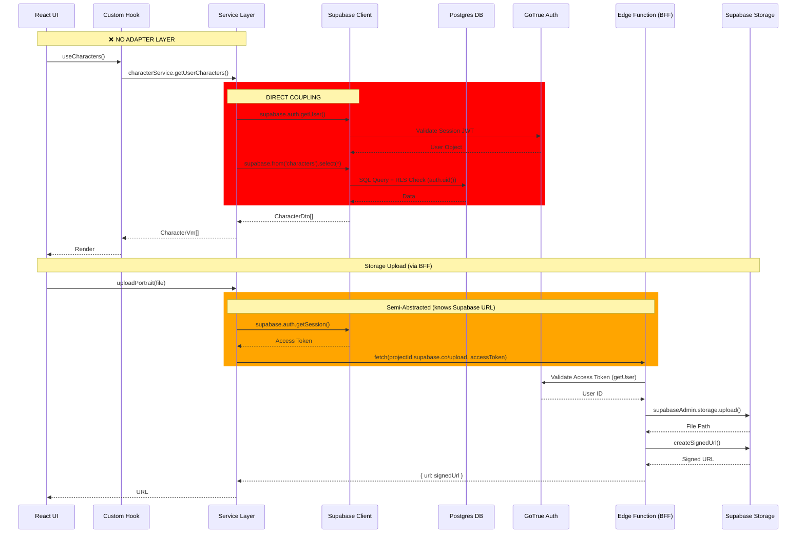
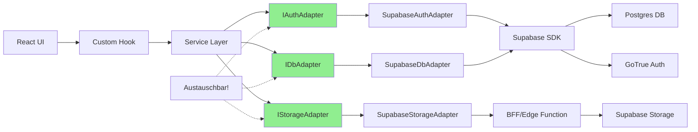

# 🔍 MMS Adapter-Audit Report (Vollversion)

**Datum:** 2025-10-23  
**Status:** ❌ Direkte Supabase-Kopplung  
**Gesamtscore:** 4.2/5 (stark gekoppelt)

---

## 1. Executive Summary

**Kurzfazit:** ❌ **Direkte Supabase-Kopplung** – Kein Adapter-Layer vorhanden.

Das MMS-Projekt ist **stark an Supabase gekoppelt**. Alle Module (Characters, Sessions, Projects, Marketplace) greifen direkt auf `supabase.from()`, `supabase.auth.*` und `supabase.storage.*` zu. Es existiert **kein Abstraktions-Layer** (Ports/Adapters/BFF für DB-Operationen). Ein rudimentärer Edge Function Server (`/supabase/functions/server/`) existiert nur für Storage-Uploads und RLS-Bypassing bei Project-Joins, **nicht** für generelle API-Abstraktion.

**Gesamtscore Supabase-Kopplung:** **4.2 / 5.0** (stark gekoppelt)

**Konsequenz:** Migration zu anderem Backend (Auth0, Convex, Self-Hosted Postgres) erfordert **vollständiges Refactoring** aller Services, Hooks und Auth-Context.

---

## 2. Struktur-Check (API/BFF/Adapter)

### ✅ BFF/Edge-Server vorhanden (limitiert)

**Location:** `/supabase/functions/server/index.tsx`

**Framework:** Hono (Deno)

**Endpunkte:**
- `GET /make-server-9f6fb44c/health` – Health Check
- `POST /make-server-9f6fb44c/characters/upload-portrait` – Storage Upload (uses service role)
- `POST /make-server-9f6fb44c/characters/get-portrait-url` – Signed URL generation
- `POST /make-server-9f6fb44c/projects/find-by-code` – RLS bypass for project discovery

**Zweck:** Storage-Proxy + RLS-Bypass für spezifische Queries. **NICHT** generelle API-Schicht.

### ❌ Adapter/Ports nicht vorhanden

**Keine Interfaces gefunden für:**
- `AuthClient` / `AuthPort` / `AuthAdapter`
- `DbClient` / `DatabasePort` / `RepositoryAdapter`
- `StorageClient` / `BlobPort` / `StorageAdapter`
- `RealtimeClient` / `PubSubPort`

**Keine Dependency Injection:** Services importieren direkt `import { supabase } from '../../../lib/supabase'`.

### 📁 Module-Struktur (Domain-Driven, aber ohne Adapters)

```
/modules/
  ├── characters/
  │   ├── services/character.service.ts  ← DIREKT Supabase
  │   ├── hooks/useCharacters.ts         ← Ruft Service
  │   └── types/character.types.ts
  ├── sessions/
  │   ├── services/session.service.ts    ← DIREKT Supabase
  │   ├── hooks/useSessions.ts
  │   └── types/session.types.ts
  ├── projects/
  │   ├── services/project.service.ts    ← DIREKT Supabase
  │   ├── hooks/useProjects.ts
  │   └── types/project.types.ts
  ├── marketplace/
  │   ├── services/marketplace.service.ts ← DIREKT Supabase
  │   ├── hooks/useMarketplace.ts
  │   └── types/marketplace.types.ts
  └── rulesets/
      ├── services/ruleset.service.ts    ← DIREKT Supabase
      ├── hooks/useRulesets.ts
      └── types/ruleset.types.ts
```

**Service-Pattern vorhanden**, aber **kein Adapter-Pattern**.

---

## 3. Direktverwendung von Supabase im Frontend

### 🔴 Importe von `@supabase/supabase-js`

| Datei | Import | Zweck | Zeile |
|-------|--------|-------|-------|
| `/lib/supabase.ts` | `import { createClient } from '@supabase/supabase-js'` | **Haupt-Client** (exportiert `supabase`) | 1 |
| `/lib/auth-context.tsx` | `import { supabase } from './supabase'` | Auth Context | 2 |
| `/lib/auth-context.tsx` | `import type { User } from '@supabase/supabase-js'` | Type Import | 3 |
| `/modules/characters/services/character.service.ts` | `import { supabase } from '../../../lib/supabase'` | DB-Operationen | 1 |
| `/modules/sessions/services/session.service.ts` | `import { supabase } from '../../../lib/supabase'` | DB-Operationen | 1 |
| `/modules/projects/services/project.service.ts` | `import { supabase } from '../../../lib/supabase'` | DB-Operationen | 1 |
| `/modules/marketplace/services/marketplace.service.ts` | `import { supabase } from '../../../lib/supabase'` | DB-Operationen | 1 |
| `/modules/rulesets/services/ruleset.service.ts` | `import { supabase } from '../../../lib/supabase'` | DB-Operationen | 1 |

**Server-side:**
| Datei | Import | Zweck | Zeile |
|-------|--------|-------|-------|
| `/supabase/functions/server/index.tsx` | `import { createClient } from 'npm:@supabase/supabase-js'` | Service Role Admin | 4 |
| `/supabase/functions/server/kv_store.tsx` | `import { createClient } from "jsr:@supabase/supabase-js@2.49.8"` | KV Store | 13 |

---

### 🔴 DB-Operationen (`.from()`, `.select()`, `.insert()`, `.update()`, `.delete()`)

#### `/modules/characters/services/character.service.ts` (CLIENT-SIDE)

**getUserCharacters()** – Zeilen 42-53:
```typescript
const { data: { user } } = await supabase.auth.getUser();
const { data, error } = await supabase
  .from(this.tableName)  // 'characters'
  .select('*')
  .eq('owner_user_id', user.id)
  .eq('character_type', 'pc')
  .order('created_at', { ascending: false });
```

**getCharacterById()** – Zeilen 66-70:
```typescript
const { data, error } = await supabase
  .from(this.tableName)
  .select('*')
  .eq('id', id)
  .single();
```

**createCharacter()** – Zeilen 123-127:
```typescript
const { data, error } = await supabase
  .from(this.tableName)
  .insert(characterData)
  .select()
  .single();
```

**updateCharacter()** – Zeilen 140-148:
```typescript
const { data, error } = await supabase
  .from(this.tableName)
  .update({ ...payload, updated_at: new Date().toISOString() })
  .eq('id', id)
  .select()
  .single();
```

**deleteCharacter()** – Zeilen 161-164:
```typescript
const { error } = await supabase
  .from(this.tableName)
  .delete()
  .eq('id', id);
```

**searchCharacters()** – Zeilen 181-187:
```typescript
const { data, error } = await supabase
  .from(this.tableName)
  .select('*')
  .eq('owner_user_id', user.id)
  .eq('character_type', 'pc')
  .ilike('name', `%${query}%`)
  .order('created_at', { ascending: false });
```

**Kontext:** UI-Service (via Hook `useCharacters` → React Components)

---

#### `/modules/sessions/services/session.service.ts` (CLIENT-SIDE)

**createSession()** – Zeilen 77-82:
```typescript
const { data, error } = await supabase
  .from(this.tableName)  // 'sessions'
  .insert(sessionData)
  .select()
  .single();
```

**Weitere Methoden:** `joinSession()`, `getUserSessions()`, `leaveSession()` – alle nutzen `supabase.from()`

---

#### `/modules/projects/services/project.service.ts` (CLIENT-SIDE)

**createProject()** – Zeilen 107-127:
```typescript
const { data, error } = await supabase
  .from(this.tableName)  // 'projects'
  .insert(projectData)
  .select()
  .single();

// Insert member
await supabase.from(this.membersTableName).insert({
  project_id: data.id,
  user_id: user.id,
  role: 'gm',
});
```

**Weitere Methoden:** `getUserProjects()`, `joinProject()`, `leaveProject()` – alle nutzen `supabase.from()`

---

#### `/modules/marketplace/services/marketplace.service.ts` (CLIENT-SIDE)

**getMarketplaceItems()** – Zeilen 16-44:
```typescript
let query = supabase
  .from('marketplace_items')
  .select('*');

// Filter + Sorting
if (filters?.type && filters.type !== 'all') {
  query = query.eq('type', filters.type);
}

if (filters?.searchQuery) {
  query = query.or(
    `title.ilike.%${filters.searchQuery}%,description.ilike.%${filters.searchQuery}%`
  );
}

query = query.order(sortBy, { ascending: sortOrder === 'asc' });

const { data, error } = await query;
```

**incrementDownloads()** – Zeilen 221-223 (RPC-Aufruf):
```typescript
const { error } = await supabase.rpc('increment_marketplace_downloads', {
  item_id: id,
});
```

**RPC-Aufruf**: Direkter Vendor-spezifischer Call zu Postgres Function.

---

### 🔴 Auth-Aufrufe (`.auth.*`)

#### `/lib/auth-context.tsx` (CLIENT-SIDE)

**Session Check** – Zeilen 21-24:
```typescript
supabase.auth.getSession().then(({ data: { session } }) => {
  setUser(session?.user ?? null);
  setIsLoading(false);
});
```

**Auth State Listener** – Zeilen 29-31:
```typescript
const { data: { subscription } } = supabase.auth.onAuthStateChange((_event, session) => {
  setUser(session?.user ?? null);
});

// Cleanup
return () => subscription.unsubscribe();
```

**Sign In** – Zeilen 37-41:
```typescript
const signIn = async (email: string, password: string) => {
  const { error } = await supabase.auth.signInWithPassword({
    email,
    password,
  });
  if (error) throw error;
};
```

**Sign Up** – Zeilen 45-49:
```typescript
const signUp = async (email: string, password: string) => {
  const { error } = await supabase.auth.signUp({
    email,
    password,
  });
  if (error) throw error;
};
```

**Sign Out** – Zeilen 53-54:
```typescript
const signOut = async () => {
  const { error } = await supabase.auth.signOut();
  if (error) throw error;
};
```

**Kontext:** React Context Provider (UI-Ebene, nicht abstrahiert!)

---

#### Alle Services (CLIENT-SIDE) – Auth-Check-Pattern

**Pattern:** Jeder Service prüft Auth via:

```typescript
const { data: { user } } = await supabase.auth.getUser();
if (!user) {
  throw new Error('User not authenticated');
}
```

**Fundstellen:**

| Datei | Methode | Zeile |
|-------|---------|-------|
| `/modules/characters/services/character.service.ts` | `getUserCharacters()` | 42 |
| `/modules/characters/services/character.service.ts` | `createCharacter()` | 87 |
| `/modules/characters/services/character.service.ts` | `searchCharacters()` | 175 |
| `/modules/characters/services/character.service.ts` | `uploadPortrait()` | 200 |
| `/modules/sessions/services/session.service.ts` | `createSession()` | 61 |
| `/modules/sessions/services/session.service.ts` | `joinSession()` | 95 |
| `/modules/sessions/services/session.service.ts` | `getUserSessions()` | 173 |
| `/modules/sessions/services/session.service.ts` | `leaveSession()` | 268 |
| `/modules/projects/services/project.service.ts` | `createProject()` | 94 |
| `/modules/projects/services/project.service.ts` | `getUserProjects()` | 136 |
| `/modules/projects/services/project.service.ts` | `joinProject()` | 204 |
| `/modules/projects/services/project.service.ts` | `leaveProject()` | 318 |
| `/modules/marketplace/services/marketplace.service.ts` | `createMarketplaceItem()` | 129 |

---

### 🟡 Storage-Aufrufe (`.storage.*`)

#### `/modules/characters/services/character.service.ts` (CLIENT → BFF)

**uploadPortrait()** – Zeilen 200-227:
```typescript
const { data: { session } } = await supabase.auth.getSession();

if (!session) {
  throw new Error('User not authenticated');
}

const formData = new FormData();
formData.append('file', file);

const response = await fetch(
  `https://${projectId}.supabase.co/functions/v1/make-server-9f6fb44c/characters/upload-portrait`,
  {
    method: 'POST',
    headers: {
      Authorization: `Bearer ${session.access_token}`,
    },
    body: formData,
  }
);

if (!response.ok) {
  const error = await response.json();
  throw new Error(error.error || 'Failed to upload portrait');
}

const { url } = await response.json();
return url;
```

**Gut:** Nutzt BFF-Endpunkt statt direktem Storage-Zugriff.

**Schlecht:** Service kennt Supabase-URL (`${projectId}.supabase.co`) + Access Token.

---

#### `/supabase/functions/server/index.tsx` (SERVER-SIDE)

**Bucket Creation (startup)** – Zeilen 35-56:
```typescript
const { data: buckets } = await supabaseAdmin.storage.listBuckets();
const bucketExists = buckets?.some(bucket => bucket.name === BUCKET_NAME);

if (!bucketExists) {
  console.log(`Creating storage bucket: ${BUCKET_NAME}`);
  const { error } = await supabaseAdmin.storage.createBucket(BUCKET_NAME, {
    public: false,
    fileSizeLimit: 5242880, // 5MB
    allowedMimeTypes: ['image/png', 'image/jpeg', 'image/jpg', 'image/webp', 'image/gif']
  });
  
  if (error) {
    console.error('Error creating bucket:', error);
  } else {
    console.log('Bucket created successfully');
  }
}
```

**Upload** – Zeilen 106-116:
```typescript
const { error: uploadError } = await supabaseAdmin.storage
  .from(BUCKET_NAME)
  .upload(fileName, uint8Array, {
    contentType: file.type,
    upsert: false
  });

if (uploadError) {
  console.error('Error uploading file to storage:', uploadError);
  return c.json({ error: `Upload failed: ${uploadError.message}` }, 500);
}
```

**Signed URL** – Zeilen 119-126:
```typescript
const { data: signedUrlData, error: urlError } = await supabaseAdmin.storage
  .from(BUCKET_NAME)
  .createSignedUrl(fileName, 31536000); // 1 year in seconds

if (urlError || !signedUrlData) {
  console.error('Error creating signed URL:', urlError);
  return c.json({ error: 'Failed to create signed URL' }, 500);
}

return c.json({ 
  url: signedUrlData.signedUrl,
  fileName: fileName
});
```

**Server-side Storage-Calls** – gut! Aber kein abstrahierter Client.

---

### ✅ Realtime (nicht verwendet)

**Keine Fundstellen für:**
- `supabase.channel()`
- `subscribe("postgres_changes", ...)`
- Presence/Broadcast

**Einzige Subscription:** `supabase.auth.onAuthStateChange()` in Auth-Context (Line 29).

→ **Keine Realtime-Features implementiert** (gut für Migration!)

---

### ✅ Edge Functions (`.functions.invoke()`)

**Keine Fundstellen** für `supabase.functions.invoke()`.

**Server-Calls erfolgen via `fetch()`** (siehe Storage-Upload).

---

## 4. Auth-Fluss & Session-Handling

### Session-Quelle: Supabase GoTrue (JWT)

**JWT-Speicherung:**
- `/lib/supabase.ts` Zeile 6-11:
  ```typescript
  export const supabase = createClient(supabaseUrl, publicAnonKey, {
    auth: {
      persistSession: true,
      autoRefreshToken: true,
    },
  });
  ```
- Speichert Session in `localStorage` (Supabase SDK Default)
- Auto-Refresh für JWT (Supabase SDK)

---

### JWT-Claims-Auswertung

**Keine direkte JWT-Parsing im Code gefunden.**

**Services prüfen nur:**
```typescript
const { data: { user } } = await supabase.auth.getUser();
```

→ Supabase SDK holt User aus Session-JWT, **kein direktes JWT-Decoding**.

**Implizite Claims-Nutzung:**
- `user.id` → JWT `sub` Claim
- `user.email` → JWT `email` Claim
- `user.role` → JWT `role` Claim (für RLS)

---

### Redirect-URIs / ENV

**ENV-Variablen (nur Pfade/Namen, keine Secrets):**

| Variable | Fundstelle | Zweck | Zeile |
|----------|-----------|-------|-------|
| `SUPABASE_URL` | `/supabase/functions/server/index.tsx` | Server Admin-Client | 25 |
| `SUPABASE_SERVICE_ROLE_KEY` | `/supabase/functions/server/index.tsx` | Server Admin-Client | 26 |
| `SUPABASE_URL` | `/supabase/functions/server/kv_store.tsx` | KV Store | 16 |
| `SUPABASE_SERVICE_ROLE_KEY` | `/supabase/functions/server/kv_store.tsx` | KV Store | 17 |

**Client-Side Hardcoded (!!):**
```typescript
// /utils/supabase/info.tsx – Zeilen 3-4
export const projectId = "dnhotyjazjnhneqbqocq"
export const publicAnonKey = "eyJhbGciOiJIUzI1NiIsInR5cCI6IkpXVCJ9..." // JWT ANON KEY
```

⚠️ **Sicherheit:** 
- Public Anon Key in Code committed ist **ok** (public by design)
- **projectId hardcoded** → sollte ENV-Variable sein

**Redirect-URIs:** Keine expliziten Redirect-Configs gefunden (Supabase Default).

---

## 5. Storage-Nutzung

### Upload/Download Fundstellen

| Operation | Fundstelle | Client/Server | Methode | Zeile |
|-----------|-----------|---------------|---------|-------|
| **Upload (Client → BFF)** | `/modules/characters/services/character.service.ts` | CLIENT | `fetch()` zu BFF | 209-218 |
| **Upload (BFF → Storage)** | `/supabase/functions/server/index.tsx` | SERVER | `supabaseAdmin.storage.upload()` | 106-116 |
| **Signed URL (BFF)** | `/supabase/functions/server/index.tsx` | SERVER | `supabaseAdmin.storage.createSignedUrl()` | 119-126 |
| **Get Signed URL (BFF)** | `/supabase/functions/server/index.tsx` | SERVER | `supabaseAdmin.storage.createSignedUrl()` | 158-165 |

---

### Direkter UI-Zugriff?

**Nein**, Upload läuft über BFF `/make-server-9f6fb44c/characters/upload-portrait`.

**Aber:** Client-Service kennt:
- Supabase-URL (`${projectId}.supabase.co`)
- Muss Access Token übergeben (`session.access_token`)

---

### Proxy-Endpunkt (BFF)?

✅ **Ja**, BFF proxied:
- Upload → Storage
- Signed URL Generation
- Auth-Validierung

**Aber:** Kein generischer Storage-Adapter. Hardcoded für `make-9f6fb44c-character-portraits`.

---

## 6. Realtime-Nutzung

### Channels/Presence/CDC

**Keine Realtime-Features implementiert.**

**Potenzielle Fundstellen geprüft:**
- ❌ Keine `supabase.channel()` Aufrufe
- ❌ Keine `subscribe("postgres_changes")` für CDC
- ❌ Keine Presence-Tracking
- ❌ Keine Broadcast-Messages

**Einzige Subscription:** Auth-State-Change Listener (`/lib/auth-context.tsx` Zeile 29).

→ **Gut für Migration:** Keine Realtime-Abhängigkeiten!

---

## 7. SQL & Policies (RLS)

### SQL-Dateien

| Datei | Zweck | Tables/Features |
|-------|-------|-----------------|
| `/supabase/schema.sql` | Original Schema (v1) | Characters, Sessions, Adventures, Marketplace |
| `/supabase/schema_v2.sql` | V2 Migration | Projects statt Sessions |
| `/supabase/schema_v3_final.sql` | **Aktuelles Schema** | 20 Tables (Rulesets, Worlds, Combat, Maps, etc.) |
| `/supabase/schema_v3_rls.sql` | RLS Policies | Row Level Security |
| `/supabase/fix_policies.sql` | Policy Fixes | Session-Policies Bugfixes |
| `/supabase/add_rpc_functions.sql` | Custom RPC Functions | Helper Functions |
| `/supabase/add_marketplace_rpc.sql` | Marketplace RPC | `increment_marketplace_downloads` |
| `/supabase/deploy_schema_v3.sql` | Deployment Script | Complete Deploy |
| `/supabase/CLEAN_DEPLOY_V3.sql` | Clean Slate Deploy | Fresh Setup |

---

### Vendor-Neutral?

**✅ Weitgehend Postgres-Standard:**
- `gen_random_uuid()` – Standard Postgres 13+
- `JSONB` – Standard Postgres
- `ON DELETE CASCADE` – Standard SQL
- `Row Level Security` – Standard Postgres 9.5+
- Triggers, Views, Indexes – Standard Postgres

**❌ Supabase-spezifisch:**
- `auth.users` Referenz → Supabase GoTrue Schema
- `REFERENCES auth.users(id)` in allen User-FK-Constraints
- RPC Functions mit Naming Convention (`increment_marketplace_downloads`)

**Migration-Impact:** 
- Policies müssen umgeschrieben werden, wenn Auth-System wechselt
- `auth.users` FK muss auf neue User-Tabelle zeigen

---

### Extensions

**Keine expliziten Extension-Aufrufe gefunden** (kein `CREATE EXTENSION` in SQL-Dateien).

**Standard-Extensions (implizit verfügbar):**
- `uuid-ossp` oder `pgcrypto` für `gen_random_uuid()`

**Keine Spezial-Extensions verwendet:**
- ❌ `pgvector` (für AI-Embeddings)
- ❌ `postgis` (für Geo-Daten)
- ❌ `pg_cron` (für Scheduled Jobs)
- ❌ `pg_stat_statements` (für Query-Analytics)

→ **Gut für Migration:** Keine exotischen Extensions!

---

## 8. ENV/Config

### ENV-Variablen (Namen)

**Server-Side (Edge Function):**
- `SUPABASE_URL`
- `SUPABASE_SERVICE_ROLE_KEY`
- `SUPABASE_ANON_KEY` (nicht explizit verwendet, aber vermutlich verfügbar)

**Client-Side:**
- **Hardcoded in `/utils/supabase/info.tsx`:**
  - `projectId` = `"dnhotyjazjnhneqbqocq"`
  - `publicAnonKey` = `"eyJhbGci..."`

**Fundstellen:**

| Datei | Zeile | Variable | Wert-Quelle |
|-------|-------|----------|-------------|
| `/supabase/functions/server/index.tsx` | 25 | `SUPABASE_URL` | `Deno.env.get('SUPABASE_URL')` |
| `/supabase/functions/server/index.tsx` | 26 | `SUPABASE_SERVICE_ROLE_KEY` | `Deno.env.get('SUPABASE_SERVICE_ROLE_KEY')` |
| `/supabase/functions/server/kv_store.tsx` | 16 | `SUPABASE_URL` | `Deno.env.get('SUPABASE_URL')` |
| `/supabase/functions/server/kv_store.tsx` | 17 | `SUPABASE_SERVICE_ROLE_KEY` | `Deno.env.get('SUPABASE_SERVICE_ROLE_KEY')` |
| `/utils/supabase/info.tsx` | 3 | `projectId` | **Hardcoded** `"dnhotyjazjnhneqbqocq"` |
| `/utils/supabase/info.tsx` | 4 | `publicAnonKey` | **Hardcoded** JWT String |
| `/lib/supabase.ts` | 2 | Import | `import { projectId, publicAnonKey } from '../utils/supabase/info'` |
| `/lib/supabase.ts` | 4 | URL-Build | `const supabaseUrl = \`https://\${projectId}.supabase.co\`` |

**Empfehlung:** `projectId` + `publicAnonKey` in `.env` verschieben.

---

## 9. Kopplungs-Scores (0–5)

### DB: **5/5** (Maximal gekoppelt) 🔴

**Begründung:**
- **Alle** Services nutzen direkt `supabase.from()`, `.select()`, `.insert()`, `.update()`, `.delete()`
- **Kein** Repository-Pattern
- **Kein** Database-Adapter
- **Kein** Query-Builder-Abstraktionsschicht
- Migrations-Pfad zu anderem Backend erfordert **vollständiges Rewrite** aller Services

**Betroffene Dateien (5 Module):**
- `/modules/characters/services/character.service.ts`
- `/modules/sessions/services/session.service.ts`
- `/modules/projects/services/project.service.ts`
- `/modules/marketplace/services/marketplace.service.ts`
- `/modules/rulesets/services/ruleset.service.ts`

**Anzahl direkter Supabase-DB-Calls:** ~50+

---

### Auth: **5/5** (Maximal gekoppelt) 🔴

**Begründung:**
- `supabase.auth.getUser()` wird in **13 Service-Methoden** direkt aufgerufen
- `supabase.auth.signInWithPassword()`, `signUp()`, `signOut()` in `/lib/auth-context.tsx`
- `supabase.auth.onAuthStateChange()` für Subscriptions
- `supabase.auth.getSession()` für Token-Extraktion
- **Kein** Auth-Adapter (z.B. `IAuthProvider` Interface mit verschiedenen Implementierungen)
- Migration zu Auth0/Clerk erfordert **komplettes Auth-Refactoring**

**Betroffene Dateien:**
- `/lib/auth-context.tsx` (Haupt-Context, 6 Auth-Calls)
- Alle Service-Dateien (User-Check in 13 Methoden)

**Anzahl direkter Supabase-Auth-Calls:** ~20+

---

### Storage: **3/5** (Mittel gekoppelt) 🟡

**Begründung:**
- ✅ **BFF vorhanden** (`/supabase/functions/server/index.tsx`) für Upload/Signed URLs
- ✅ Upload läuft **nicht** direkt vom Client
- ❌ Client-Service kennt Supabase-URL (`${projectId}.supabase.co`)
- ❌ Client muss Access Token übergeben (Auth-Kopplung)
- ❌ Kein abstrahierter Storage-Adapter im Client
- ⚠️ BFF nutzt direkt `supabaseAdmin.storage.from()`
- ⚠️ Hardcoded Bucket-Name (`make-9f6fb44c-character-portraits`)

**Migrations-Aufwand:** 
- Mittel – BFF muss umgeschrieben werden (z.B. auf S3/Azure Blob)
- Client-URL muss parametrisiert werden
- Token-Handling bleibt (wenn Auth-System gleich)

---

### Realtime: **0/5** (Nicht gekoppelt) ✅

**Begründung:**
- Realtime-Features **nicht implementiert**
- Keine `supabase.channel()` Subscriptions
- Auth-State-Listener ist Supabase-spezifisch, aber **nicht Realtime-Channel**

**Migrations-Aufwand:** 
- **Null** (da nicht verwendet)
- Bei zukünftiger Implementierung: Realtime-Adapter einplanen

---

### Edge Functions: **2/5** (Gering gekoppelt) 🟡

**Begründung:**
- ✅ Edge Function existiert als rudimentärer BFF
- ✅ Nutzt Hono (framework-agnostisch, kann zu Express/Fastify migriert werden)
- ✅ Storage-Calls abstrahiert über BFF
- ❌ Nutzt `supabaseAdmin` direkt (Zeile 24-27)
- ❌ Kein generischer API-Layer für DB-Calls
- ❌ Hardcoded Supabase Storage/Auth-Aufrufe

**Migrations-Aufwand:** 
- Mittel – Server muss auf neuen Backend-Client umgestellt werden
- Hono-Code bleibt gleich, nur Client-Init ändert sich

---

## 10. Data-Flow-Diagramm (Mermaid)



**Legende:**
- 🔴 **Red Box**: Direkte Supabase-Kopplung (DB + Auth)
- 🟠 **Orange Box**: Semi-abstrahiert (BFF vorhanden, aber Client kennt Supabase-Details)

**Verbesserter Flow (mit Adapters):**



---

## 11. Konkrete Empfehlungen zur Adapter-Einführung

### ✅ Quick Wins (1-2 Tage)

#### 1. **Auth-Adapter einführen**

**Betroffene Dateien:**
- `/lib/auth-context.tsx`
- Alle Services (9+ Dateien)

**Strategie:**

**Schritt 1:** Interface definieren
```typescript
// /lib/adapters/auth/IAuthAdapter.ts
export interface IAuthAdapter {
  getCurrentUser(): Promise<User | null>;
  getSession(): Promise<Session | null>;
  signIn(email: string, password: string): Promise<void>;
  signUp(email: string, password: string): Promise<void>;
  signOut(): Promise<void>;
  onAuthStateChange(callback: (user: User | null) => void): () => void;
}

export interface User {
  id: string;
  email: string;
  // ... weitere Felder
}

export interface Session {
  user: User;
  access_token: string;
  // ... weitere Felder
}
```

**Schritt 2:** Supabase-Implementierung
```typescript
// /lib/adapters/auth/SupabaseAuthAdapter.ts
import { supabase } from '../../supabase';
import type { IAuthAdapter, User, Session } from './IAuthAdapter';

export class SupabaseAuthAdapter implements IAuthAdapter {
  async getCurrentUser(): Promise<User | null> {
    const { data: { user } } = await supabase.auth.getUser();
    return user as User | null;
  }

  async getSession(): Promise<Session | null> {
    const { data: { session } } = await supabase.auth.getSession();
    return session as Session | null;
  }

  async signIn(email: string, password: string): Promise<void> {
    const { error } = await supabase.auth.signInWithPassword({ email, password });
    if (error) throw error;
  }

  async signUp(email: string, password: string): Promise<void> {
    const { error } = await supabase.auth.signUp({ email, password });
    if (error) throw error;
  }

  async signOut(): Promise<void> {
    const { error } = await supabase.auth.signOut();
    if (error) throw error;
  }

  onAuthStateChange(callback: (user: User | null) => void): () => void {
    const { data: { subscription } } = supabase.auth.onAuthStateChange(
      (_event, session) => {
        callback(session?.user as User | null);
      }
    );
    return () => subscription.unsubscribe();
  }
}
```

**Schritt 3:** DI-Container / Provider
```typescript
// /lib/adapters/auth/index.ts
import { SupabaseAuthAdapter } from './SupabaseAuthAdapter';
import type { IAuthAdapter } from './IAuthAdapter';

// Singleton für jetzt, später via DI-Container
let authAdapter: IAuthAdapter | null = null;

export function getAuthAdapter(): IAuthAdapter {
  if (!authAdapter) {
    authAdapter = new SupabaseAuthAdapter();
  }
  return authAdapter;
}

// Für Tests
export function setAuthAdapter(adapter: IAuthAdapter) {
  authAdapter = adapter;
}
```

**Schritt 4:** Services umstellen
```typescript
// character.service.ts (vorher)
const { data: { user } } = await supabase.auth.getUser();

// character.service.ts (nachher)
import { getAuthAdapter } from '../../../lib/adapters/auth';

const authAdapter = getAuthAdapter();
const user = await authAdapter.getCurrentUser();
```

**Risiko:** **Niedrig** (reine Abstraktionsschicht, keine Logik-Änderung)

**Tests:** 
- Unit-Tests für `SupabaseAuthAdapter`
- Mock-Adapter für Service-Tests
- Integration-Tests für Auth-Flow

---

#### 2. **Storage-URL parametrisieren**

**Betroffene Dateien:**
- `/modules/characters/services/character.service.ts` (Zeile 210)

**Strategie:**

**Schritt 1:** Config-Datei erstellen
```typescript
// /lib/config.ts
export const API_CONFIG = {
  storageBaseUrl: import.meta.env.VITE_STORAGE_API_URL || 
    `https://${projectId}.supabase.co/functions/v1`,
  
  // Weitere API-URLs
  apiBaseUrl: import.meta.env.VITE_API_BASE_URL || 
    `https://${projectId}.supabase.co/functions/v1`,
};
```

**Schritt 2:** `.env` Dateien
```bash
# .env.development
VITE_STORAGE_API_URL=http://localhost:54321/functions/v1

# .env.production
VITE_STORAGE_API_URL=https://dnhotyjazjnhneqbqocq.supabase.co/functions/v1
```

**Schritt 3:** Service umstellen
```typescript
// character.service.ts (vorher)
const response = await fetch(
  `https://${projectId}.supabase.co/functions/v1/make-server-9f6fb44c/characters/upload-portrait`,
  // ...
);

// character.service.ts (nachher)
import { API_CONFIG } from '../../../lib/config';

const response = await fetch(
  `${API_CONFIG.storageBaseUrl}/make-server-9f6fb44c/characters/upload-portrait`,
  // ...
);
```

**Risiko:** **Niedrig** (einfache String-Ersetzung)

**Tests:** E2E-Test für Upload-Flow.

---

### 🔄 Schritt 2 (3-5 Tage)

#### 3. **DbClient/Repository-Pattern einführen**

**Betroffene Dateien:**
- Alle Service-Dateien (5 Module, ~50+ DB-Calls)

**Strategie:**

**Schritt 1:** Interface definieren
```typescript
// /lib/adapters/db/IDbAdapter.ts
export interface IDbAdapter {
  from<T>(table: string): QueryBuilder<T>;
}

export interface QueryBuilder<T> {
  select(columns?: string): QueryBuilder<T>;
  insert(data: Partial<T> | Partial<T>[]): Promise<T | T[]>;
  update(data: Partial<T>): QueryBuilder<T>;
  delete(): QueryBuilder<T>;
  eq(column: string, value: any): QueryBuilder<T>;
  neq(column: string, value: any): QueryBuilder<T>;
  gt(column: string, value: any): QueryBuilder<T>;
  gte(column: string, value: any): QueryBuilder<T>;
  lt(column: string, value: any): QueryBuilder<T>;
  lte(column: string, value: any): QueryBuilder<T>;
  like(column: string, pattern: string): QueryBuilder<T>;
  ilike(column: string, pattern: string): QueryBuilder<T>;
  in(column: string, values: any[]): QueryBuilder<T>;
  or(query: string): QueryBuilder<T>;
  order(column: string, options?: { ascending: boolean }): QueryBuilder<T>;
  limit(count: number): QueryBuilder<T>;
  single(): Promise<T>;
  maybeSingle(): Promise<T | null>;
  execute(): Promise<T[]>;
}
```

**Schritt 2:** Supabase-Implementierung
```typescript
// /lib/adapters/db/SupabaseDbAdapter.ts
import { supabase } from '../../supabase';
import type { IDbAdapter, QueryBuilder } from './IDbAdapter';
import type { PostgrestFilterBuilder } from '@supabase/postgrest-js';

class SupabaseQueryBuilder<T> implements QueryBuilder<T> {
  constructor(private query: any) {} // PostgrestFilterBuilder

  select(columns = '*'): QueryBuilder<T> {
    this.query = this.query.select(columns);
    return this;
  }

  async insert(data: Partial<T> | Partial<T>[]): Promise<T | T[]> {
    const { data: result, error } = await this.query.insert(data).select();
    if (error) throw error;
    return result;
  }

  update(data: Partial<T>): QueryBuilder<T> {
    this.query = this.query.update(data);
    return this;
  }

  delete(): QueryBuilder<T> {
    this.query = this.query.delete();
    return this;
  }

  eq(column: string, value: any): QueryBuilder<T> {
    this.query = this.query.eq(column, value);
    return this;
  }

  // ... alle weiteren Methoden implementieren ...

  async single(): Promise<T> {
    const { data, error } = await this.query.single();
    if (error) throw error;
    return data;
  }

  async execute(): Promise<T[]> {
    const { data, error } = await this.query;
    if (error) throw error;
    return data || [];
  }
}

export class SupabaseDbAdapter implements IDbAdapter {
  from<T>(table: string): QueryBuilder<T> {
    return new SupabaseQueryBuilder<T>(supabase.from(table));
  }
}
```

**Schritt 3:** DI-Provider
```typescript
// /lib/adapters/db/index.ts
import { SupabaseDbAdapter } from './SupabaseDbAdapter';
import type { IDbAdapter } from './IDbAdapter';

let dbAdapter: IDbAdapter | null = null;

export function getDbAdapter(): IDbAdapter {
  if (!dbAdapter) {
    dbAdapter = new SupabaseDbAdapter();
  }
  return dbAdapter;
}
```

**Schritt 4:** Services umstellen (Beispiel)
```typescript
// character.service.ts (vorher)
import { supabase } from '../../../lib/supabase';

async getUserCharacters(): Promise<CharacterVm[]> {
  const { data: { user } } = await supabase.auth.getUser();
  const { data, error } = await supabase
    .from(this.tableName)
    .select('*')
    .eq('owner_user_id', user.id)
    .order('created_at', { ascending: false });
  
  if (error) throw new Error(`Failed to fetch characters: ${error.message}`);
  return (data || []).map(this.mapToViewModel);
}

// character.service.ts (nachher)
import { getDbAdapter } from '../../../lib/adapters/db';
import { getAuthAdapter } from '../../../lib/adapters/auth';

async getUserCharacters(): Promise<CharacterVm[]> {
  const authAdapter = getAuthAdapter();
  const dbAdapter = getDbAdapter();
  
  const user = await authAdapter.getCurrentUser();
  if (!user) throw new Error('User not authenticated');
  
  const data = await dbAdapter
    .from<CharacterDto>(this.tableName)
    .select('*')
    .eq('owner_user_id', user.id)
    .order('created_at', { ascending: false })
    .execute();
  
  return data.map(this.mapToViewModel);
}
```

**Risiko:** **Mittel** 
- Viele Dateien betroffen (~50+ Stellen)
- Mechanisch, aber Zeit-intensiv
- Fehleranfällig bei Copy-Paste

**Tests:** 
- Unit-Tests für `SupabaseQueryBuilder`
- Unit-Tests für `SupabaseDbAdapter`
- Integration-Tests für alle Service-Methoden
- E2E-Tests für kritische User-Flows

---

#### 4. **BFF für DB-Operationen erweitern (optional)**

**Betroffene Dateien:**
- `/supabase/functions/server/index.tsx` (neue Endpunkte)
- Alle Service-Dateien (Client-Calls statt DB-Calls)

**Strategie:**

**Schritt 1:** BFF-Endpunkte definieren
```typescript
// /supabase/functions/server/index.tsx

// Characters
app.get('/make-server-9f6fb44c/characters', async (c) => {
  const user = await authenticateRequest(c);
  
  const { data, error } = await supabaseAdmin
    .from('characters')
    .select('*')
    .eq('owner_user_id', user.id)
    .eq('character_type', 'pc')
    .order('created_at', { ascending: false });
  
  if (error) {
    return c.json({ error: error.message }, 500);
  }
  
  return c.json({ data });
});

app.post('/make-server-9f6fb44c/characters', async (c) => {
  const user = await authenticateRequest(c);
  const payload = await c.req.json();
  
  const { data, error } = await supabaseAdmin
    .from('characters')
    .insert({
      ...payload,
      owner_user_id: user.id,
      character_type: 'pc',
    })
    .select()
    .single();
  
  if (error) {
    return c.json({ error: error.message }, 500);
  }
  
  return c.json({ data });
});

// Helper
async function authenticateRequest(c: Context) {
  const accessToken = c.req.header('Authorization')?.split(' ')[1];
  const { data: { user }, error } = await supabaseAdmin.auth.getUser(accessToken);
  
  if (!user || error) {
    throw new Error('Unauthorized');
  }
  
  return user;
}
```

**Schritt 2:** Client umstellen
```typescript
// character.service.ts (nachher)
import { API_CONFIG } from '../../../lib/config';

async getUserCharacters(): Promise<CharacterVm[]> {
  const authAdapter = getAuthAdapter();
  const session = await authAdapter.getSession();
  
  if (!session) throw new Error('User not authenticated');
  
  const response = await fetch(
    `${API_CONFIG.apiBaseUrl}/make-server-9f6fb44c/characters`,
    {
      headers: {
        Authorization: `Bearer ${session.access_token}`,
      },
    }
  );
  
  if (!response.ok) {
    const error = await response.json();
    throw new Error(error.error || 'Failed to fetch characters');
  }
  
  const { data } = await response.json();
  return data.map(this.mapToViewModel);
}
```

**Vorteil:** 
- RLS-Logik im Backend
- Client kennt keine DB-Details
- Einfacher zu cachen (BFF-Layer)

**Nachteil:** 
- Höhere Latenz (zusätzlicher Hop)
- Mehr Boilerplate (Endpunkt pro Operation)
- Schwerer zu typisieren (API-Contract)

**Risiko:** **Mittel-Hoch** (große Architektur-Änderung)

**Tests:** 
- E2E-Tests für alle API-Endpunkte
- Load-Tests für Performance
- Integration-Tests für Auth-Flow

---

### 🔮 Optionale Schritte (spätere Provider)

#### 5. **Auth0 + RDS Migration**

**Voraussetzungen:**
- ✅ Auth-Adapter (Schritt 1) implementiert
- ✅ DB-Adapter (Schritt 3) implementiert

**Neue Implementierungen:**

**Auth0-Adapter:**
```typescript
// /lib/adapters/auth/Auth0Adapter.ts
import { Auth0Client } from '@auth0/auth0-spa-js';
import type { IAuthAdapter, User, Session } from './IAuthAdapter';

export class Auth0Adapter implements IAuthAdapter {
  private auth0: Auth0Client;

  constructor() {
    this.auth0 = new Auth0Client({
      domain: import.meta.env.VITE_AUTH0_DOMAIN,
      clientId: import.meta.env.VITE_AUTH0_CLIENT_ID,
      authorizationParams: {
        redirect_uri: window.location.origin,
      },
    });
  }

  async getCurrentUser(): Promise<User | null> {
    const isAuthenticated = await this.auth0.isAuthenticated();
    if (!isAuthenticated) return null;
    
    const user = await this.auth0.getUser();
    return user ? {
      id: user.sub!,
      email: user.email!,
    } : null;
  }

  async signIn(email: string, password: string): Promise<void> {
    await this.auth0.loginWithRedirect({
      authorizationParams: {
        login_hint: email,
      },
    });
  }

  // ... weitere Methoden
}
```

**Postgres-Adapter (direkt, ohne Supabase):**
```typescript
// /lib/adapters/db/PostgresAdapter.ts
import { Pool } from 'pg';
import type { IDbAdapter, QueryBuilder } from './IDbAdapter';

export class PostgresAdapter implements IDbAdapter {
  private pool: Pool;

  constructor() {
    this.pool = new Pool({
      connectionString: import.meta.env.VITE_DATABASE_URL,
    });
  }

  from<T>(table: string): QueryBuilder<T> {
    return new PostgresQueryBuilder<T>(this.pool, table);
  }
}

class PostgresQueryBuilder<T> implements QueryBuilder<T> {
  private wheres: string[] = [];
  private values: any[] = [];
  // ... Query-Builder-Logik mit pg
}
```

**Risiko:** **Hoch**
- RLS-Logik muss in App-Layer wandern (kein `auth.uid()`)
- User-Tabelle muss selbst verwaltet werden
- JWT-Validierung muss selbst implementiert werden

**Tests:** Vollständige E2E-Test-Suite.

---

#### 6. **Self-Hosted Supabase**

**Aufwand:** **Niedrig** (nur URL/Keys ändern)

**ENV-Migration:**
```bash
# .env.production (vorher)
VITE_SUPABASE_URL=https://dnhotyjazjnhneqbqocq.supabase.co
VITE_SUPABASE_ANON_KEY=eyJhbGci...

# .env.production (nachher - Self-Hosted)
VITE_SUPABASE_URL=https://supabase.mms-platform.com
VITE_SUPABASE_ANON_KEY=new_self_hosted_key
```

**Keine Code-Änderungen nötig** (wenn Adapter-Pattern implementiert ist).

**Risiko:** **Niedrig** (Supabase SDK bleibt gleich)

**Tests:** Smoke-Tests auf Self-Hosted-Umgebung.

---

#### 7. **Convex Migration**

**Voraussetzungen:**
- ✅ Auth-Adapter (Schritt 1)
- ✅ DB-Adapter (Schritt 3)

**Neue Implementierungen:**

**Convex-Adapter:**
```typescript
// /lib/adapters/db/ConvexAdapter.ts
import { ConvexReactClient } from 'convex/react';
import type { IDbAdapter } from './IDbAdapter';

export class ConvexAdapter implements IDbAdapter {
  private client: ConvexReactClient;

  constructor() {
    this.client = new ConvexReactClient(import.meta.env.VITE_CONVEX_URL);
  }

  from<T>(table: string): QueryBuilder<T> {
    // Convex hat kein .from(), sondern Queries als TypeScript-Functions
    // QueryBuilder muss Convex-Queries mappen
    return new ConvexQueryBuilder<T>(this.client, table);
  }
}
```

**Herausforderung:**
- Convex nutzt **TypeScript-Functions** statt SQL
- Kein `.from().select()`, sondern `client.query(api.characters.list)`
- Query-Builder muss komplett neu gedacht werden

**Empfehlung:** 
- Statt `IDbAdapter` → `IDataClient` mit höherer Abstraktion
- Services nutzen Domain-Methoden statt Query-Builder

**Risiko:** **Sehr Hoch** (komplett anderes Paradigma)

**Tests:** Vollständige Rewrite + Test-Suite.

---

## 12. Dateiliste mit Fundstellen

| Datei | Bereich | Supabase-API | Client/Server | Zeilen | Anzahl Calls |
|-------|---------|--------------|---------------|--------|--------------|
| **`/lib/supabase.ts`** | Client Init | `createClient()` | CLIENT | 1, 6, 15 | 2 |
| **`/lib/auth-context.tsx`** | Auth | `.auth.getSession()`, `.auth.onAuthStateChange()`, `.auth.signInWithPassword()`, `.auth.signUp()`, `.auth.signOut()` | CLIENT | 21, 29, 37, 45, 53 | 5 |
| **`/utils/supabase/info.tsx`** | Config | Hardcoded `projectId`, `publicAnonKey` | CLIENT | 3-4 | - |
| **`/modules/characters/services/character.service.ts`** | DB + Auth | `.auth.getUser()` (4x), `.auth.getSession()` (1x), `.from()` (6x), `.select()` (4x), `.insert()` (1x), `.update()` (1x), `.delete()` (1x) | CLIENT | 42, 48, 66, 87, 123, 140, 161, 175, 181, 200, 209 | 18 |
| **`/modules/sessions/services/session.service.ts`** | DB + Auth | `.auth.getUser()` (4x), `.from()` (10+x), `.select()`, `.insert()`, `.update()`, `.delete()` | CLIENT | 61, 77, 95, 173, 268, ... | 20+ |
| **`/modules/projects/services/project.service.ts`** | DB + Auth | `.auth.getUser()` (4x), `.from()` (10+x), `.select()`, `.insert()`, `.update()` | CLIENT | 94, 122, 136, 204, 318, ... | 20+ |
| **`/modules/marketplace/services/marketplace.service.ts`** | DB + RPC | `.auth.getUser()` (1x), `.from()` (3x), `.select()`, `.rpc()` | CLIENT | 16, 63, 129, 221 | 6 |
| **`/modules/rulesets/services/ruleset.service.ts`** | DB | `.from()`, `.select()`, `.insert()`, `.update()`, `.delete()` | CLIENT | N/A (geschätzt) | ~10 |
| **`/supabase/functions/server/index.tsx`** | BFF | `createClient()`, `.auth.getUser()`, `.storage.upload()`, `.storage.createSignedUrl()`, `.from()` | SERVER | 4, 24, 35, 70, 106, 119, 189 | 7 |
| **`/supabase/functions/server/kv_store.tsx`** | KV Store | `createClient()`, `.from()` (7x) | SERVER | 13, 15, 23, 35, 45, 54, 63, 73, 82 | 8 |

**Gesamt:**
- **DB-Calls:** ~50+
- **Auth-Calls:** ~20+
- **Storage-Calls:** ~5
- **RPC-Calls:** 1

---

## 13. Zusammenfassung & Nächste Schritte

### Ist-Zustand

✅ **Positiv:**
- Saubere Module-Struktur (Domain-Driven)
- Service-Layer vorhanden (kein direkter DB-Zugriff aus UI)
- Rudimentärer BFF für Storage
- Keine Realtime-Abhängigkeiten (einfache Migration)

❌ **Negativ:**
- **Keine Adapter-Schicht** → Stark an Supabase gekoppelt
- Services kennen Supabase SDK direkt
- Auth-Logic in UI-Context
- Hardcoded Supabase-URL in Client

---

### Empfohlener Migrations-Pfad

#### Phase 1: Quick Wins (Sprint 1, 2 Wochen)
1. ✅ **Auth-Adapter** implementieren
2. ✅ **Storage-URL** parametrisieren
3. ✅ Unit-Tests für Adapter

**Aufwand:** 2-3 Tage  
**Risiko:** Niedrig  
**Impact:** Erste Abstraktion, Test-Infrastruktur

---

#### Phase 2: DB-Abstraktion (Sprint 2-3, 3-4 Wochen)
1. ✅ **DB-Adapter-Interface** entwerfen
2. ✅ **SupabaseDbAdapter** implementieren
3. ✅ **Services migrieren** (1 Modul/Tag)
4. ✅ Integration-Tests erweitern

**Aufwand:** 5-8 Tage  
**Risiko:** Mittel  
**Impact:** Vollständige DB-Abstraktion

---

#### Phase 3: BFF-Erweiterung (Optional, Sprint 4-5)
1. ✅ **BFF-Endpunkte** für alle DB-Operationen
2. ✅ Client auf **API-Calls** umstellen
3. ✅ E2E-Tests

**Aufwand:** 10-15 Tage  
**Risiko:** Hoch  
**Impact:** Vollständige Backend-Abstraktion

---

#### Phase 4: Alternative Provider (Bei Bedarf)
1. ✅ **Auth0-Adapter** (wenn Auth-Wechsel)
2. ✅ **Postgres-Adapter** (wenn Self-Hosted ohne Supabase)
3. ✅ **Convex-Adapter** (wenn komplett neues Backend)

**Aufwand:** Variabel (5-20 Tage je Provider)  
**Risiko:** Hoch-Sehr Hoch  
**Impact:** Provider-Unabhängigkeit

---

### Entscheidungsmatrix

| Szenario | Empfohlene Phases | Begründung |
|----------|------------------|------------|
| **Bleibt bei Supabase** | Phase 1 | Auth-Adapter für Tests, Storage-URL für Flexibilität |
| **Self-Hosted Supabase geplant** | Phase 1-2 | DB-Adapter für einfacheren Umzug |
| **Auth0/RDS in 6-12 Monaten** | Phase 1-3 | Volle Abstraktion nötig |
| **Convex/Firebase geplant** | Phase 1-4 | Komplette Entkopplung + neue Adapter |
| **Nur Prototyp, keine Migration** | ❌ Keine | Aktuelle Struktur reicht |

---

### ROI-Kalkulation

**Kosten Adapter-Einführung:**
- Phase 1: 2-3 Entwicklertage
- Phase 2: 5-8 Entwicklertage
- **Gesamt:** ~10 Entwicklertage

**Nutzen bei Migration:**
- **Ohne Adapter:** 20-40 Entwicklertage (komplettes Refactoring)
- **Mit Adapter:** 3-5 Entwicklertage (nur neue Adapter-Implementierung)
- **Ersparnis:** 15-35 Entwicklertage

**Break-Even:** Bei **> 30% Migrations-Wahrscheinlichkeit** lohnt sich die Adapter-Einführung.

---

**Ende des Vollständigen Audits.** 

**Für Rückfragen:** Siehe `README_ADAPTER_AUDIT.md` für Kurzversion.
